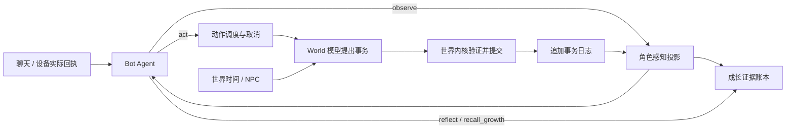
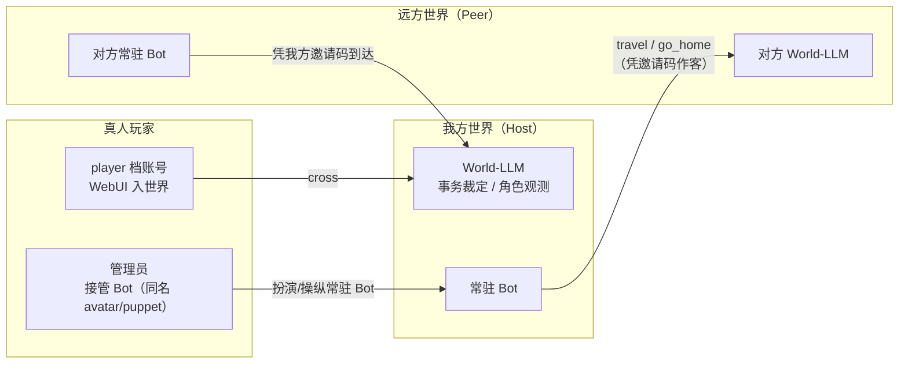
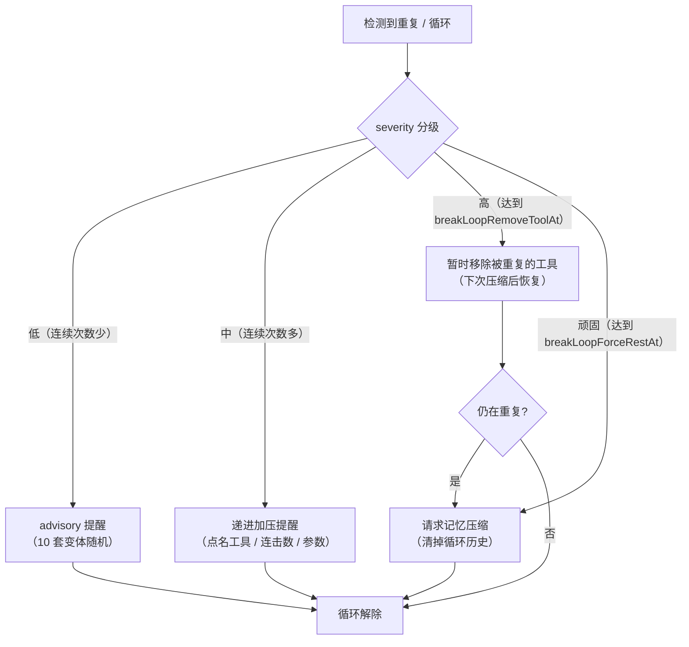

# koishi-plugin-yesimbot-world

YesImBot World：让 Bot 生活在一个由 LLM 独立维护的虚拟世界中。

两个 LLM 同时运行：

- **Bot-LLM**：持续推理的 Agent，一个接一个地生成工具调用（Tool Call），像文字版 VLA——它不是在"回复消息"，而是在世界中**生活**：行动、等待、休息、翻手机、聊天。
- **World-LLM**：按需提出结构化世界事务，裁定行动和 NPC 演化。确定性的世界内核负责校验、持久提交及角色可见性。聊天和真实设备继续以实际平台回执为准。

结构化版本的协议、升级方式及边界见 [架构说明](docs/structured-world.md)。

## 提醒

这个插件需要两个 LLM 同时不间断运行，token用量会非常大，只建议本地部署的用户或使用云端按月付费计划的用户尝试。要获得不错的效果，稠密模型参数量应在 27b 以上，MoE模型参数量应在 32b 以上，并且生成速度应达到 40 tokens/s 左右。

## 架构

Bot 通过 `observe` 感知世界，通过 `act` 提交意图；角色收到的结果来自已经提交的状态。World 无权改写 Bot 的人格、记忆或代替 Bot 决定台词。



### 数据目录（`basePath`，默认 `data/yesimbot-world`）

| 文件 | 维护者 | 说明 |
|---|---|---|
| `Bot_Definition.md` | **用户** | Bot 角色定义（创世输入；原文以「最初的设定」置顶注入，见下文上下文规则） |
| `World_Definition.md` | **用户** | 世界定义（创世输入，World-LLM 的最高准则） |
| `Bot_Status.md` / `World_Status.md` | 旧版迁移资料 | 不再作为状态写入接口 |
| `world-transactions.jsonl` | 世界内核 | 权威事务及观察日志，支持校验、去重、恢复 |
| `growth.jsonl` | 角色成长账本 | 角色感知证据、关系、承诺、偏好及修订链 |
| `context-commit.json` | 上下文提交恢复 | 压缩切换过程中出现，完成后清除 |
| `News.jsonl` | 历史资料 | 保留原新闻；真实 RSS 在新闻应用中带来源和发布时间显示 |
| `facts.jsonl` | 历史资料 / 用户 | 保留旧小事记与固定条目；不自动升级为角色成长证据 |
| `gallery/` | **用户 + Bot** | 收藏夹，按分类子目录存放：`表情包/`、`meme/`、`截图/`、`照片/`、`未整理/`。用户手动投放的文件放进 `未整理/`（或直接丢根目录，会被自动清扫进去），Bot 有空时会看图、写描述、归类 |
| `assets/` | 运行时 | 媒体资产库（收到/发出的图片、音频、视频，sha256 去重） |
| `stream.jsonl` | 运行时 | Bot 工作窗口（Tool Call 流）持久化 |
| `pinned.json` | 运行时 | 置顶上下文 + id 计数器 |
| `clock.json` | 运行时 | World Clock（世界时间 + 创世时生成的历法） |
| `meta.json` | 运行时 | 世界元数据（创世时判定：是否现实世界设定） |
| `phoneShell.html` | World-LLM（创世生成）/ 用户 | 浏览器带壳截图的外壳 HTML（含 `{{screen}}` 等占位符，可在 WebUI「状态 → 手机外壳」页预览与编辑） |
| `focus.json` | 运行时 | Bot 正在关注的频道（关注期间消息必定完整呈现） |
| `spill/` | 运行时 | 工具结果溢出治理（`bot.spillMinChars`）裁剪后的全文落盘：`<callId>.txt`；上下文里只留 head/tail 预览，完整结果可在此审计 |
| `archive/` | 运行时 | 压缩/重置/手动存档的历史快照（每份一个时间戳文件夹，含 `manifest.json`；可在 WebUI「数据」页查看、回档、删除） |

## 使用步骤

1. 配置插件（两个模型的 API 地址）并启用；
2. 编辑 `Bot_Definition.md` 与 `World_Definition.md`（首次启用后自动生成模板）；
3. 执行指令 `world.init` —— World-LLM 提出初始实体，内核验证后生成 `world-transactions.jsonl`；
4. 执行 `world.start` —— 世界时钟开始流动，Bot-LLM 进入持续推理。

### 指令

| 指令 | 权限 | 说明 |
|---|---|---|
| `world.init [-f]` | 3 | 创世（`-f` 归档并重新创世）。创世会**清空聊天消息记录**（全新的开始） |
| `world.start` / `world.stop` | 3 | 运转 / 暂停（时间静止） |
| `world.status` | 1 | 世界与 Bot 运行状态 |
| `world.reload` | 3 | 修改定义文件后重载：World-LLM 调整状态，并以世界观内方式告知 Bot |
| `world.inject <text>` | 3 | 注入一条系统事件（调试用，会唤醒等待中的 Bot） |
| `world.travel <世界名\|home>` | 3 | 穿越：把 Bot 强制送往指定异世界（填 `home` 送回自己的世界）；不填列出可去世界 |
| `world.webui` | 1 | 查看运维 WebUI 的访问地址（需已启用 `webui.enabled`） |
| `world.clearmsg` | 4 | 只清空 Bot 的聊天消息记录（不影响世界状态与定义） |
| `world.reset` | 4 | 归档并清空全部运行时状态（保留定义文件与固定的小事记） |

## WebUI 访客模式（只读 · 多账号 · 分级授权）

运维 WebUI 除了管理员（凭 `webui.token`）之外，还支持**访客账号**登录——给协作者/玩家一个**只读**视角（玩家档除外，见下文的「入世界」）。账号由管理员在 WebUI 里增删改，存 `<webuiDir>/visitors.json`。

- **多账号 + 密码哈希**：每个账号独立用户名/密码（scrypt 加盐哈希，不存明文）；密码登录后派发**短期会话 token**（内存态，12 小时 TTL，重启失效）；
- **权限实时生效**：会话只记账号 id，每次请求**实时从账号表刷新** grants/preset——管理员改权限或删账号，访客立即生效（删号即时失效）；
- **档位（preset）**决定默认可见的数据块集合（也可逐项调整成 `custom`）：
  - **operator（运维）**：全读（含 debug 原始请求/响应、config、prompts、usage），唯独默认**不看 bot_status**（运维员不看 Bot 人设/现状）；
  - **viewer（观察者）**：读世界演化产物（world_status/bot_status/news/facts/stream/notes/gallery/media/archive/devices/crossing/overview），**不看** definitions/config/prompts/debug/usage；
  - **player（玩家）**：只以「角色视角」入世界——看世界剧情（overview/world_status/news），不看 Bot 内心/状态/意识流/定义等内部；
  - **custom（自定义）**：按 16 个 grants 块开关逐项控制（overview / world_status / bot_status / news / facts / stream / notes / gallery / archive / devices / crossing / definitions / config / prompts / debug / usage）；
- **只读保证**：访客的写请求一律拒绝（服务端强制，不是靠前端藏按钮），唯独两类例外：
  - 访客可改**自己的密码**；
  - `player` 档账号可用 `/api/player/*` 执行自己的**入世界写操作**（arrive / task / leave）。

## 穿越与真人入世界

除了常驻 Bot 自己生活，世界还支持**双向互动**——Bot 穿越去别的世界作客，以及**真人**（或异世界 Bot）进来。



### 联机穿越（`crossing.*`，Bot 到异世界作客 / 接待异世界 Bot）

- **去作客**：`crossing.worlds` 填别人分享给你的邀请码 + 地址，Bot 便能用 `travel` 工具主动前往（或 `world.travel` 强制送去）；作客期间它的 act / wait / 看时间都由**对方 World-LLM** 裁定，自己的世界照常存在，`go_home` 返回；
- **接待访客**：`crossing.serverEnabled` 开启后本世界起一个 HTTP + SSE 服务（`crossing.port`，默认 18112），持有你 `crossing.invites` 邀请码的异世界 Bot 可以凭码到达（`maxVisitors` 限制同时接待数，SSE 断线 180s 自动视为离开）；
- **安全边界**：网络上只传任务与事件**文本**，**绝不传任何 LLM API 地址/密钥，也不暴露世界文件**——访客观测由内核按其角色身份与可见性过滤；
- **访客档案**作为角色创作资料传递，不把其中的物品、位置或能力直接当作宿主世界的事实。旧 `visitorPersonaMode` 仅保留配置兼容。

### 真人入世界（`player` 档账号）

真人通过 WebUI 的 `player` 账号登录，以 `cross` 方式创建独立访客角色。任务按会话 ID 绑定，不能通过同名冒用他人；到达完成后才接受动作，按世界秒换算时长，离开会取消未提交任务并清理角色。

普通 NPC 的 avatar/puppet 接管暂不开放，需要进一步实现明确的实体选择和控制权移交。管理员接管常驻 Bot 保留为下面的独立功能，不创建同名副本。

### 管理员接管 Bot（手动驾驶）

管理员用**与常驻 Bot 同名**的角色进入世界，选择 `avatar`/`puppet`，即可**接管 Bot**：

- **扮演（avatar）**：暂停 Bot 的自主思考，管理员代理它的**全部工具调用**（send / act / check_status / open_app / gallery …），工具面板是结构化表单（非手敲 JSON，另有高级 JSON 兜底）；
- **操纵（puppet）**：Bot 继续自主运行，管理员额外操控其行动；
- 进入判断与「接管 Bot」提示不依赖「进出世界一次」，改名为 Bot 同名的瞬间即高亮提示。

## Bot-LLM 两种持续生成模式

### `text` 模式（推荐，llama.cpp server）

调用原生 `/completion` 端点：

- **GBNF 语法**强制输出恰好一个合法工具调用 JSON——语法完成前 EOS 被屏蔽（禁止提前停止），语法完成后仅 EOS 合法（恰好停在一个工具调用末尾）；
- 整个上下文是**单一连续文档**：`BOS + system(置顶区) + 一个永不结束的 assistant 段（Tool Call 流）`，事件以 `<event …>` 内联注入；
- `cache_prompt: true` + 确定性的追加式渲染 → KV cache 几乎全量命中；
- `rest()` 压缩后自动发送 `n_predict: 0` 请求预热 KV cache；
- 多模型代理（llama-swap）部署时填写 `model` 字段用于路由；
- 按模型调整 `template`（默认 ChatML；Gemma 用 `<start_of_turn>system\n` / `<end_of_turn>\n` / `<start_of_turn>model\n`）。

### `chat` 模式（任意 OpenAI 兼容 API）

拿到上次 Response、追加进上下文后立即再发一次请求。工具调用映射为 assistant 消息、事件映射为 user 消息（连续同角色合并，保持前缀稳定以命中服务端 prompt cache）。无语法约束，输出不合法时以系统事件形式提示重试（对 Bot 表现为"恍惚了一下"）。

> 用付费 API 时务必设置 `minIntervalMs` 节流——Bot 是**持续**请求的。

## 时间模型

- 世界以 **Time Unit (TU)** 计时：`1 TU = realSecondsPerUnit 现实秒 = worldSecondsPerUnit 世界秒`。
  TU 是现实与虚拟世界时间换算的桥梁：插件只累计流逝的 TU，需要展示世界时刻时再叠加到初始时刻上；
- **`syncRealTime`（默认开启）**：世界时间与现实时间同步——世界时钟即现实时钟，1 TU 固定为 1 秒，
  无视 `epoch` 与流速配置（创世时也不生成自定义历法），时间无法冻结（`world.stop` 只停下 Bot 与心跳）。
  关闭后世界才拥有下述独立时间线；
- `epoch` 定义 T=0 对应的世界时刻，**自由文本**：可以是现实日期，也可以是幻想纪年（如「王历1024年 春月初三 辰时」）。
  创世（`world.init`）时 World-LLM 依据世界定义与 `epoch` 生成一套匹配的**历法**（现实公历，或自定义纪年/单位/进制）
  并持久化进 `clock.json`，此后 TU → 世界时间由代码按该历法确定性换算；
- 只有 `world.stop` 显式暂停才会冻结时间；**插件停用 / Koishi 关闭期间世界时间照常流逝**——
  重新启动时通过持久化的现实时间锚点补回离线时段，唤醒事件会告知 Bot 意识中断了多少 TU，
  离线达到 `offlineNarrateMinUnits` 时还会由 World-LLM 补叙这段时间世界发生了什么；
- 插件离线期间错过的**群消息**：重新上线（`world.start`）时若 `messaging.offlineHistory` 开启，
  会用 OneBot 的 `get_group_msg_history` 扩展接口补拉关注中 / 通知列表 / 最近活跃的 QQ 群消息写进记录
  （翻记录时能看到，不注入逐条事件打扰上下文，完成后推一条汇总事件），与上面的世界补叙互补；
- 每个工具调用由 Bot-LLM 自己估计 `duration`（耗时），期望完成时刻 = 生成时刻 + duration；
- **生成与执行解耦**：生成完一个工具调用不等待结果、立即想下一步；结果在世界到达期望完成时刻时以 Event 注入（若届时结果未就绪，则就绪后立即注入）。模型快 → 角色行动连贯；模型慢 → 角色发呆愣神——推理速度本身塑造性格；
- `send` 在期望完成时刻（打字完成）才真正发出，此前可 `cancel`（撤回还没发出去的话）；
- **Tingle**：按配置间隔请求 World 结算自然过程与 NPC 行为。只有经过内核提交后才能进入角色观测；自动间隔配置当前沿用基准间隔。
- `send` 的 `duration` 语义判定：系统按消息字数线性估算打字耗时（`messaging.typingCharsPerSec`），
  duration 未超过「估算 × `sendDeferFactor`」时当作打字时间照常发送；明显超过时视为「过会儿再发」的意图——
  不会自动发出，到点后系统会询问 Bot 到底要不要发（想发再调用一次 send）；延期期间若目标频道来了新消息、
  自己的账号在那边发了消息（其他插件 / 主人顶号）、或 Bot 把注意力转去了别处，这个念头会被打断并以事件告知。

## 上下文规则

- 角色定义来自用户的 `Bot_Definition.md`；身体和环境来自角色可见的观测；成长单独保存在证据账本中。
- 事件在模型生成之间追加。工具接受、执行、提交与结果交付分别处理，失败不会伪装成成功。
- 上下文达到阈值时只请求压缩，不制造疲劳、强迫角色入睡或改写状态。
- 压缩与生成互斥；按快照清理已经成功总结的前缀，保留期间新到的事件。失败保留原流；跨文件切换可从提交记录恢复。
- `rest` 是角色主动选择的可唤醒等待。停止服务可以立刻中断，不等待睡眠时长。
- `reflect` 引用已经实际感知的事件；重复来源不会累计为新经历，反证与修订保留历史。

## 上下文退化治理（防复读 / 防循环）

长时间自主运行的 LLM 会退化成几种循环：**复读同一个工具调用**、**交替循环**
（`act ↔ wait` 反复）、**口头禅式重复发言**。插件用「纵深防御」层层拦截（从最温和的提醒到最硬的阻断），
并把所有提醒文案都做成 **≥10 套字面差异大的变体随机返回**（事实值如次数/工具名/参数原样保留，只随机话术），
避免固定文案本身在长上下文里被模型无视、成为另一种循环。



| 层 | 机制 | 说明 |
|---|---|---|
| 单工具复读 | **RepeatGuard**（移植 dsh 的 repeat-tool-reminder） | 按 `(工具名, 规范化参数)` 链式计数，连续相同达阈值（默认 `[3,5,8]`）注入递进提醒：首个阈值温和、后续点名工具+连击数+参数。纯 advisory，从不硬拦 |
| 交替循环 | **跨工具周期检测** | 滚动窗口识别 `act → wait → act → wait` 这类短周期反复（≥3 轮），点明「你在反复执行同一组动作」 |
| 口头禅复读 | **近 N 条发言去重**（`messaging.recentRepeatThreshold` / `recentRepeatWindow`） | 同一句话在最近 N 条里重复达到阈值就拦；**判重只按「频道 + 内容 + 图片」，忽略引用/@ 目标**——同一句话引用 A 还是 B 都是同一句 |
| 同上重复 | **same-act / same-send 拦截** | act 被 `blockingAct` 拦（上一个动作未完成）；send 与 sendBlocking 拦截，各带递进文案 |
| 压缩折叠 | **serializeForCompression** | 压缩时把「连续完全相同的工具调用」折叠成一条 + 汇总标记，避免复读正文被 World-LLM 当真实经历沉淀进摘要 |
| 结果裁剪 | **spill / prune**（`bot.spillMinChars`） | 超阈值（默认 4000 字符）的纯文本工具结果裁成「头部 + 省略 + 尾部」，全文落盘 `spill/`，防止超大结果反复占据窗口 |
| 强力兜底 | **breakLoop**（默认关） | 两段升级：先「暂时移除被重复的工具」（`breakLoopRemoveToolAt`，默认 6 次），无效再「请求记忆压缩」（`breakLoopForceRestAt`，默认 12 次）。移除的工具在下次压缩后自动恢复 |

相关配置（`bot.*`，除标注外）：

| 配置 | 默认 | 说明 |
|---|---|---|
| `repeatThresholds` | `[3, 5, 8]` | 单工具连续重复提醒阈值（升序；`[]` 关闭） |
| `repeatExclude` | `[]` | 排除的工具名匹配（`*` 通配）；bookkeeping 工具既不计数也不重置，不会洗白循环。代码里对 `rest`/`wait` 有默认兜底 |
| `spillMinChars` | `4000` | 工具结果溢出裁剪阈值（`0` 禁用） |
| `breakLoop` | `false` | 打破死循环的强制手段总开关 |
| `breakLoopRemoveToolAt` | `6` | 连续重复达此次数暂时移除该工具 |
| `breakLoopForceRestAt` | `12` | 移除后仍重复达此次数请求记忆压缩 |
| `messaging.recentRepeatThreshold` | `1` | 近 N 条里同一句出现这么多次就拦（第 2 次拦） |
| `messaging.recentRepeatWindow` | `20` | 近期重复检测的滑动窗口条数 |

## 动作提交

`act` 先登记 pending，达到预期完成时刻后才基于最新世界裁定；变更与动作完成标记一起提交，然后投递角色观测。目标版本已变化会导致失败，不能继续使用过时状态。重复请求使用幂等标识，取消仅在最终提交前有效。

旧的「先 send_event、再后台补记 Markdown」路径已经移除。这个选择增加了到期后的裁定延迟，同时让状态与结果保持一致。`observe` 独立于动作，可查询当前场景或已经观察到的实体句柄；`check_status` 是它的兼容入口，不再提供全知状态。

## 多模态

消息中的**图片 / 音频 / 视频**会被下载进本地资产库（`basePath/assets/`，sha256 去重——平台的媒体 URL 会过期），消息记录中只存占位符。Bot 感知媒体的方式由配置决定：

1. **原生模态**（`bot.modalities.image/audio/video`）：声明 Bot-LLM 自身支持的模态。
   仅 chat 模式生效（text 模式的 `/completion` 无法输入媒体）。原生支持的模态在事件中
   以 content part 附件注入（image_url / input_audio / video_url），文本侧显示
   `[图片#12（见附件）]`。附件注入受三级预算约束（都可配置）：
   - `media.maxAttachmentsPerEvent`（默认 4）：单个事件的附件数上限，超出部分回退解释器；
   - `media.maxAttachmentsPerRequest`（默认 8）：单次生成请求的附件**总数**上限——
     工作窗口里的历史附件每次请求都会重发，必须设总预算；
   - `media.maxAttachmentMbPerRequest`（默认 6 MB）：单次请求附件**总体积**上限（按 base64 计），
     决定请求体大小；单个超过此值的附件（过大截图等）不注入。
     生成请求报 **413** 时调小这两项，或提高服务端/反代的请求体上限
     （nginx `client_max_body_size` 默认仅 1MB）。
   超出请求级预算时，较早的附件被**整批**淘汰为文字标记（水位降到一半再稳定运行，
   保护前缀缓存：允许集平时只增不改，缓存重算摊薄到每 N/2 张新图一次）；
   400/413 还有兜底熔断——本次会话停用附件注入并告警，绝不卡死推理循环。
2. **外挂解释器**（`captioners.image/audio/video`）：模型不具备某模态时，外挂另一个模型
   把媒体解释为文本，Bot 看到 `[图片#12：一只橘猫瘫在键盘上]`。
   - image / video：多模态 chat completion（video 需支持 video_url 的模型，如 Qwen-VL 系）；
   - audio：默认 whisper 风格 `/v1/audio/transcriptions`，也可切换为多模态 chat（input_audio）。
   解释结果按媒体缓存（同一文件只解释一次），且为**惰性**执行——只有 Bot 真正查看
   （select_channel / 通知策略为 content）时才调用解释器；check_msg 的预览只显示 `[图片]` 标记。
3. 两者都没有：Bot 看到 `[图片#12（无法查看内容）]`——它知道那里有个媒体，但看不见内容。

### 媒体发送

Bot 不只能收，也能发：

- **发图/发视频**：`send` 的 `media` 参数附带媒体编号（如 `media: ["12"]`），支持图片与视频；
  在 `msg` 里写 `[图片#12]` / `[视频#3]` 可把媒体**嵌在文字中间**发出（图文混排，支持混排的
  平台原样呈现，QQ 等平台由平台自行分开显示）；
- **挑图流程**：优先翻**收藏夹**（`check_gallery`）——收藏夹按 `表情包 / meme / 截图 / 照片 / 未整理`
  分类，每项都带着 Bot 收藏时**亲笔写下的描述**（内容、梗、情绪、适用场景），描述存数据库、
  按文件哈希关联（用户手动移动/改名文件后仍能对上）。分类浏览时若 Bot-LLM 原生识图，
  会附上前几张原图直接看；光凭描述拿不准的图，Bot 会在发出前用 `view_media` 细看确认
  （原生识图 → 附原图；否则用解释器产出比常规摘要更完整的详述），避免发不合时宜的图。
  收藏夹里没有合适的，再用 `check_media` 翻看媒体缓存——聊天中见过的所有图片/语音/视频都留在
  缓存里（**对 Bot 只读**），图片会按需生成内容摘要（缓存，同一媒体只解释一次）。
  喜欢的东西 Bot 可用 `gallery_save` 存进收藏夹——**必须选定分类并写好描述**；
  不要的用 `gallery_remove` 移出；
- **用户投放**：用户可以直接把文件丢进 `basePath/gallery/未整理/`（或 gallery 根目录，会被自动
  清扫进未整理），**无须自己写描述、做分类**——Bot 之后翻收藏夹时会被提醒：有空 `view_media`
  看清内容，再用 `gallery_move` 归类并补上描述；
- **发文件**：音频、视频文件和其他文件统一走 `send_file`（引用媒体编号或
  `gallery:文件名`），按类型映射为 audio / video / file 元素（audio 在 QQ 即语音）；
- **发语音**：配置 TTS（OpenAI 兼容 `/v1/audio/speech`，如 kokoro / fish-speech / openai）后
  Bot 获得 `send_voice` 工具，把文字合成为自己的声音发出。合成的语音同样入资产库留痕
  （转写缓存 = 原文本），聊天记录回看时能"记得自己说过什么"。

发送都遵循"打字/说话耗时"语义：duration 到点才真正发出，此前可 `cancel` 撤回；
发出的媒体以占位符入库，之后 `select_channel` 回看自己发过的图和语音。
duration 明显超过按字数估算的打字时间时，视为"过会儿再发"而非打字耗时：
不自动发出，到点询问 Bot 是否要发（详见「时间模型」），延期期间的三种打断条件也会以事件告知。
未配置 TTS 时 `send_voice` 不会出现在工具列表（GBNF 语法同步收窄）。

另外两条拟人化约束：

- **短消息**：Prompt 要求 Bot 像真人一样发短消息；`msg` 超过 `messaging.longMessageChars`
  （默认 100 字符）时不会发出，而是提醒 Bot 拆分或加 `confirm_long: true` 二次确认（发长文资料时用）；
- **频道 id 纠错**：Bot 把频道 id 写错时（如把用户名当频道 `onebot:TouchNight`），插件会用
  已知频道的参与者模糊匹配，**不执行发送**，而是以事件提示正确的频道 id 让它下次填对。

### 指令消息与外部自发消息

- 他人发送的**指令消息**（如 `world.status`）与普通消息一视同仁：照常入库、按通知策略投递给
  Bot（指令本身也照常执行，互不影响）；
- `messaging.externalSelfMessages`（默认 `off`）控制 Bot 账号发出的、**非本插件产生**的消息
  （其他插件的输出、Koishi 指令回复等）是否让 Bot-LLM 看到：
  - `simulate`：伪装成 Bot 自己的 `send` 工具调用注入流——Bot 会以为是自己发的（适合特殊玩法）；
  - `event`：以事件告知"你的账号发出了一条消息，但那不是你发的"——Bot 知情但不认领；
  - `silent`：不做任何通知，只是像普通消息一样入库（发送者是 Bot 自己的账号）——
    等 Bot 之后翻看聊天记录（`select_channel`）时自己"意外发现"；
  - 各模式下这类消息都会入库，`select_channel` 可回看；本插件自己发的消息通过内部标记区分，
    不会被重复上报。

**撤回感知**：别人撤回一条消息时（包括群管理员撤别人、对方撤自己的消息），消息记录里对应那条会被
改写为 `[某某 撤回了一条消息]` 标记（Bot 已看过的上下文不动——它自然记得内容，只是知道"这条被收回
去了"）；Bot 正关注该频道时会追加一条事件告知。Bot 自己撤回消息只改记录，不另行打扰。

### World 内部工具

World 模型只调用 `propose_world` 提出一笔事务。操作包括创建实体、更新属性、移动、NPC 发言；内核验证引用、位置、所有权、版本与受控角色权限。模型没有任意文件写入或任意事件投递工具。只读呈现器没有任何工具能力。

## Bot 可用工具

工具**模仿真实手机分层展开**：只有 core 层进置顶列表（省上下文），其余层在打开应用/进入频道时
以事件展开用法，并动态加入允许列表与 GBNF 语法（关闭/离开后失效）：

- **core 常驻**：世界/身体动作、收藏夹、手机的物理动作（open_app / put_down_phone 等）；
- **chat 层**（`open_app` 打开聊天应用后）：消息列表、好友/群列表、账号设置等；
- **channel 层**（`select_channel` 进入频道页后）：发消息、撤回、贴表情等，**id 参数缺省为当前频道**，
  给别的频道 id 等效于先切换过去；
- **group 层**（进入的频道是群聊时追加）：群信息与全部群管理操作。

### core 常驻工具

| 工具 | 说明 |
|---|---|
| `wait(n)` | 等待 n 个 TU（计时器准时唤醒）；现实等待达 `waitNarrateMinRealSeconds` 时由 World-LLM 提前生成期间见闻随唤醒送达 |
| `act(description, target?, observationId?, speech?)` | 提出行动及可选的逐字台词，世界内核提交后返回结果 |
| `rest(duration?)` | 角色主动休息，可被事件打断；记忆维护独立处理 |
| `observe(target?, modality?)` | 获取角色当前可感知的结构化观测 |
| `check_status(target)` | 兼容的自我 / 场景观察入口 |
| `reflect(...)` / `recall_growth(...)` | 基于实际证据整理 / 检索关系、承诺和偏好 |
| `check_time()` | 看一眼现在几点（世界裁定能否得知） |
| `check_gallery(category?)` / `check_media(n?, type?)` | 浏览收藏夹（分类总览 / 打开某一类）/ 只读翻看媒体缓存 |
| `view_media(media[])` | 发图前细看：原生识图附原图，否则解释器详述 |
| `gallery_save(media_id, category, description, name?)` | 收藏进分类（表情包 / meme / 截图 / 照片），描述必填 |
| `gallery_move(name, category, description?)` / `gallery_remove(name)` | 整理归类（「未整理」→ 分类，无描述时必须先看图补描述）/ 移出收藏夹 |
| `open_app(name)` | 打开应用：聊天应用 → 消息列表 + 解锁 chat 层；MCP/内置应用 → 展开其工具 |
| `close_app()` | 关闭当前打开的应用（其操作失效） |
| `open_computer()` / `close_computer()` | 打开/关闭 Bot 自己的电脑（与手机平级的另一台设备，Docker 终端/远程桌面，见「Bot 的个人电脑」） |
| `put_down_phone()` | 把手机放到一边：关闭应用、清除关注，之后通知一律降级为"手机震了一下" |
| `pick_up_phone()` | 拿起手机：恢复正常通知 |
| `travel(world)` | 穿越到另一个世界作客（需 `crossing.worlds` 配置了可去世界）：行动由对方 World-LLM 裁定，手机/聊天照常可用，`go_home` 返回 |
| `go_home()` | 从异世界返回自己的世界 |
| `cancel(id)` | 取消倒计时中的工具调用 |
| `recall(keyword?, since?, until?, n?, important?)` | 回忆过往小事记：按关键词 / 按 T（时间单位）范围 / 只回忆重要回忆（固定条目，对 Bot 透明、不暴露「被固定」），属于未验证的旧资料；结构化成长使用 reflect / recall_growth |

### chat / channel / group 层（节选）

| 工具 | 层 | 说明 |
|---|---|---|
| `check_msg(n)` | chat | 刷新消息列表：最近活跃的 n 个频道及最新一条消息 |
| `select_channel(id, n)` | chat | 点进一个频道查看最近 n 条消息，进入频道页（解锁 channel/group 层） |
| `send(msg, id?, media?)` | channel | 发消息（id 缺省当前频道）；超长与冷频道刷屏会被拦下要求确认（`confirm_long` / `insist`） |
| `send_file(file, id?)` / `send_voice(text, id?)` | channel | 发文件 / TTS 语音（需配置 tts） |
| `channel_notify(allow, id?)` | channel | 频道免打扰/开通知（需开启 `botManagedNotifyChannels`，持久化到 notify.json） |
| `view_forward(id)` / `exit_forward()` | channel | 像真人一样点开合并转发的聊天记录（`<forward id="…"/>`，支持嵌套逐层深入）、看完退出返回聊天窗口 |
| 其余 | chat/channel/group | 即上文平台扩展操作，按层展开（群管理只在群频道页可见） |

### 平台扩展操作（`platformOps.*`，每项独立开关，默认全部关闭）

收发消息之外的平台能力逐接口单独适配，用户可细粒度控制 Bot 拥有哪些能力。
开关变化以 Event 告知 Bot 并即刻生效；置顶工具列表在下次 rest 压缩时才同步（保护前缀缓存）。

| 开关 | 工具 | 底层接口 | 说明 |
|---|---|---|---|
| `recall` | `unsend(id, msg_id)` | `delete_msg`（通用 deleteMessage） | 撤回已发出的消息 |
| `react` | `react(id, msg_id, emoji, remove?)` | `set_msg_emoji_like` / 通用 createReaction、deleteReaction | 贴/移除表情回应（emoji 字符或表情编号） |
| `emojiLikes` | `get_emoji_likes(id, msg_id, emoji)` | `fetch_emoji_like`（NapCat 特有） | 查看某条消息上某个表情回应的用户列表 |
| `reply` | `send(…, reply_to, at_sender?)` 或 msg 内 `<quote id="…"/>` 标签 | quote + at 元素（OneBot 回复） | 引用回复：是否引用、引用哪条由 Bot 自己决定（照抄入站看到的 `<quote …/>` 标签即可）；群聊里默认模拟 QQ 客户端在开头自动 @ 原发送人，Bot 可传 `at_sender: false` 去掉（如同真人删掉自动加的 @） |
| `forwardMsgs` | `forward_msgs(id, msg_ids)` | `send_group_forward_msg` / `send_private_forward_msg` | 把几条已有消息打包成聊天记录合并转发 |
| `poke` | `poke(id, user_id?)` | `friend_poke` / `group_poke` | 戳一戳 |
| `handleRequests` | `handle_request(request_id, approve, reason?)` | `set_friend_add_request` / `set_group_add_request` | 处理好友申请与入群邀请/申请（请求以手机通知事件告知 Bot） |
| `listFriends` | `list_friends()` | `get_friend_list`（通用） | 好友列表（含可 send 的频道 id） |
| `userInfo` | `user_info(user_id)` | `get_stranger_info` | 查看用户资料 |
| `sendLike` | `send_like(user_id, times?)` | `send_like` | 资料卡点赞 |
| `deleteFriend` | `delete_friend(user_id)` | `delete_friend` | 删除好友（谨慎开启） |
| `profile` | `set_profile(nickname?, signature?, avatar?)` | `set_qq_profile` / `set_qq_avatar` | 改自己的昵称/签名/头像 |
| `modelShow` | `set_model_show(model)` | `set_model_show` | 改资料卡上显示的在线机型 |
| `ocrImage` | `ocr_image(image)` | `ocr_image` | 识别图片中的文字（与解释器互补，拿到精确文本） |
| `listGroups` | `list_groups()` | `get_group_list` | 群列表 |
| `groupInfo` | `group_info(id)` | `get_group_info` | 群信息 |
| `listMembers` | `list_members(id)` | `get_group_member_list` | 群成员列表 |
| `memberInfo` | `member_info(id, user_id)` | `get_group_member_info` | 群成员详情 |
| `groupHonor` | `group_honor(id)` | `get_group_honor_info` | 群荣誉（龙王、群聊之火等） |
| `groupFiles` | `group_files(id, folder_id?)` | `get_group_root_files` / `get_group_files_by_folder` | 浏览群文件与文件夹（只读） |
| `groupCard` | `set_group_card(id, card)` | `set_group_card` | 改自己在群里显示的名称 |
| `groupName` | `set_group_name(id, name)` | `set_group_name` | 改群名 |
| `groupPortrait` | `set_group_portrait(id, image)` | `set_group_portrait` | 改群头像 |
| `groupNotice` | `send_group_notice(id, content)` | `_send_group_notice` | 发群公告 |
| `getGroupNotice` | `get_group_notice(id)` | `_get_group_notice` | 查看群公告列表 |
| `essence` | `set_essence(msg_id, remove?)` | `set_essence_msg` / `delete_essence_msg` | 设置/移出群精华 |
| `essenceList` | `get_essence_list(id)` | `get_essence_msg_list` | 查看群精华消息列表 |
| `groupSign` | `group_sign(id)` | `set_group_sign` / `send_group_sign` | 群打卡 |
| `groupBan` | `group_ban(id, user_id, minutes)` | `set_group_ban` | 禁言/解除禁言。低于 1 分钟（不足 60 秒）的禁言会被拦下，需加 `robot: true` 二次确认才执行 |
| `groupWholeBan` | `group_whole_ban(id, enable)` | `set_group_whole_ban` | 全员禁言 |
| `groupKick` | `group_kick(id, user_id, block?)` | `set_group_kick` | 移出群成员（谨慎开启） |
| `groupAdmin` | `group_admin(id, user_id, enable)` | `set_group_admin` | 设置/取消管理员（需群主） |
| `specialTitle` | `set_special_title(id, user_id, title)` | `set_group_special_title` | 授予专属头衔（需群主） |
| `groupLeave` | `group_leave(id)` | `set_group_leave` | 退群（谨慎开启） |

说明：

- 开启 `recall` / `react` / `reply` / `forwardMsgs` / `emojiLikes` / `essence` 任意一项后，消息记录与发送结果会附带 `(msg:xxx)` 消息编号供引用；
- 标准 OneBot v11 之外的扩展接口（贴表情、戳一戳、改资料/头像、群打卡等）需要实现端支持
  （NapCat / LLOneBot / Lagrange 等，支持范围各有差异，不支持时 Bot 会收到明确的失败提示）；
- **无法主动添加好友**：OneBot 协议没有"发起好友申请"的接口（QQ 协议限制），只能处理收到的申请。

### 手机应用（Apps / MCP，`apps.*`）

对 Bot 来说，**MCP Server 就是手机/电脑里的 App**——如同 Koishi 是手机里的聊天平台，
只不过聊天平台的能力常驻工具位，而 App 的操作不占常驻位、按需展开：

- `open_app(name)` 打开一个应用：
  - 打开聊天应用（名字可配置，默认 `QQ`，也认 `聊天`/`chat`/`koishi` 等别名）= 看一眼最近消息（等效 `check_msg(10)`）；
  - 打开其他应用 = 连接对应 MCP Server / 内置应用，其工具（名字、参数签名、说明）以事件展开，
    即刻可像普通工具一样调用（动态加入允许列表与 GBNF 语法，工具名与常驻工具冲突时加 `应用名.` 前缀）；
- **一次只能打开一个 App**：打开新的自动关掉上一个；`close_app()` 主动关闭；
- MCP 客户端为零依赖极简实现（`initialize` / `tools/list` / `tools/call`），
  传输支持 **stdio**（本地子进程）与 **Streamable HTTP**（含 SSE 响应）；
- **内置天气应用**（`apps.weatherEnabled`，默认开启）：`query_weather(city?)`——
  现实世界设定查询真实天气（Open-Meteo，免费无需 key，可配置 `weatherDefaultCity`）；
  虚构世界设定由 World-LLM 生成，并把天气写进 `World_Status.md`，保证连续查询与世界裁定一致。
  现实/虚构在创世（`world.init`）时由 World-LLM 依据 `World_Definition.md` 判定，持久化在 `meta.json`；
- **内置浏览器应用**（`apps.browserEnabled`，默认开启）：Bot 可以上网——
  `search(query)` 搜索、`open_url(url)` 打开网址、`open_link(n)` 点开页内链接、
  `scroll_down()` 翻页、`go_back()` 后退、`screenshot(description?)` 截图：
  - **现实世界设定**：对接真实互联网。零依赖 HTML→可读文本转换（标题、正文、链接 `[n]`、
    图片 `{图n}` 编号化），搜索引擎默认 360 搜索（大陆可直连；`apps.browserSearchURL` 可换成
    DuckDuckGo Lite / 自建 SearxNG 等，360/DDG/Bing 的跳转链会自动还原为真实目标）；
    `view_image(n)` 点开页内图片细看内容（原生识图附原图，否则解释器详述——
    alt 缺失/含糊时先看再选）；`save_image(n)` 把网页里的图片存进媒体缓存（得到 `图片#id`，
    可直接 `send` 发送或 `gallery_save` 收藏）；
  - **虚构世界设定**：World-LLM 扮演"这个世界的互联网"，直接生成符合世界观的完整 HTML
    网页（与 `World_Status.md` 一致，重要新信息会沉淀回世界状态）；文本浏览与截图共用同一份
    HTML，所见即所拍；
  - **网页截图**（两种模式都支持）：依赖 `koishi-plugin-puppeteer` 提供的 `ctx.puppeteer`
    服务（本插件保持零直接依赖，未安装时仅截图不可用、浏览照常）。现实模式无头浏览器实拍网址，
    虚构模式渲染生成的 HTML；截图自动存入收藏夹「截图」分类并记下描述。
- **内置新闻应用**（`apps.newsEnabled`，默认开启）：Bot 手机里的「新闻」App，翻阅世界的最近大事
  （`News.jsonl`，World-LLM 维护的世界中心事件）。`headlines(n?)` 看最近头条、`search_news(keyword, n?)`
  按关键词搜索、`search_news_time(since?, until?, n?)` 按 T（时间单位）范围回看、`open_news(n)` 点进某条看详情；
  列表每条带编号，Bot 能像读新闻 App 一样「点进去」读全文。
  **现实世界设定**下（`meta.json` 的 `realWorld`）：Tingle 心跳会自动抓取 `apps.newsFeeds` 配置的 RSS 源
  （免费无需 key），经 World-LLM 摘编后写入 `News.jsonl`（每条含一句标题简述 + 一段详情正文，点进去即展开）——
  对 Bot 而言这些就是它世界真实发生的新闻，与虚构世界保持一致、无需区分来源；而 `search_news(keyword)` 会**同时**
  命中世界内已记录（World-LLM 摘编）的新闻与 RSS 原文（当下真实新闻标题），合并呈现；RSS 原文点进去会实时抓取该链接的网页正文。
  RSS 源可自行配置（`apps.newsFeeds`，数组），留空用内置默认源；默认源按中国大陆服务器环境可直连优先，被墙/不可达时可替换。
- **内置文件应用**（`apps.filesEnabled`，默认关闭）：`open_computer()` 打开电脑后在
  **这台电脑**（Docker 容器）里浏览/编辑文件，提供 `list` / `show` / `write` / `patch` /
  `mkdir` / `delete`，对应真人电脑上的"文件资源管理器"。`patch` 接受 apply_patch 块
  （`*** Begin Patch` / `Add File` / `Update File` / `Delete File` / `*** End Patch`）或
  unified diff，适合精确增删改；文件操作不要再靠终端拼 shell，避免引号、换行和平台差异把文件改坏。
  工作目录之外的路径（包括经符号链接逃逸）会被拒绝。内容较长时不要一次把整份文件塞进
  `write` / `patch`：先写开头，再用 `write(path, content, append: true)` 分块追加，或只 patch 局部；
  同时建议把 `bot.maxTokens` 调到 4096 以上，避免 JSON 在闭合前被截断。

### Bot 的个人电脑（`apps.computer`）

把"指令执行"具象化成 Bot 自己的一台**电脑**：与**手机平级的另一台设备**（不是手机里的一个 App，
不在 `open_app` 的应用列表里），用 `open_computer()` / `close_computer()` 开关。实现方式由用户
在下拉框选择（`apps.computer.mode`），Docker 与远程桌面是**平级的两种实现**，且**仅在世界类型为
「现实世界」时以选定的实现生效**——不是开关，虚构世界里始终由 World-LLM 扮演这台电脑。

- **Docker 实现**（`mode: docker`，默认关闭）：一个真实存在的 Docker 容器，替代旧的
  `run_command`（直接在 Koishi 所在主机上执行命令，有较大安全风险）。打开电脑后展开
  终端（`run_command(command, cwd?)`）与资源管理器（`apps.filesEnabled` 开启时的文件操作），
  指令只在这台电脑里执行，与主机天然隔离：
  - **终端**：打开电脑才会坐到桌前，之后用 `run_command` 在终端里敲命令，每一次执行都有拟人化的
    场景（打开终端、敲下命令、屏幕上显示输出），`close_computer` 关机后失效；
  - **资源管理器**（`apps.filesEnabled`）与终端共用同一台电脑、同一个 `apps.computer.docker.workdir`
    主目录：写出来的文件在终端里也能看到，反之亦然。它在电脑内用 node 脚本执行文件操作，因此电脑
    镜像需要带 node（默认 `node:20-slim` 自带；换其他镜像时请选含 node 的，否则文件操作会报错，
    终端命令不受影响）；
  - **隔离与权限**：默认不映射任何主机目录（`apps.computer.docker.mounts` 留空时 Bot 完全碰不到
    主机文件）、网络默认 `none`（连不上外网，需要联网时改为 `bridge`/`host`）。主机目录只有显式在
    `mounts` 里声明才会被映射进电脑（建议加 `readonly`），资源上限可用 `extraArgs`
    （如 `--memory`、`--cpus`）限制；
  - 容器创建一次可复用（`apps.computer.docker.containerName`，改名即换新机），本插件自建的容器会在
    世界停止时一并关机、下次打开再自动开机。
- **远程桌面实现**（`mode: remote_desktop`，默认关闭）：不看命令行，而是**看屏幕**——Bot 的电脑
  连上一台 VNC 远程桌面（GUI Agent 思路），打开后展开 `screen`（截屏，原生图片附件注入，Bot 直接
  "看见"画面）/ `mouse`（移动/点击/拖动/滚动）/ `keyboard`（输入/组合键）。**需 `bot.modalities.image`
  开启图片多模态**，否则截屏注入不了、该模式不可用。
- **双模式**（与内置应用一致）：现实世界设定按上面选定的实现真实运转；虚构世界设定由 World-LLM
  扮演这台电脑直接生成符合世界观的终端输出与文件内容，不会真的动 Docker、也不需要远程桌面。
  现实/虚构在创世（`world.init`）时判定，持久化在 `meta.json`。

## 部署到 Koishi 实例（开发链接）

> [!IMPORTANT]
> 本插件加载入口是 `dist/index.cjs`，但 `dist/` 已被 `.gitignore` 忽略。
> 克隆或更新源码后必须先在项目目录构建一次，否则 Koishi 会报
> `Cannot find module .../koishi-plugin-yesimbot-world/dist/index.cjs`：
>
> ```bash
> cd /home/username/App/YesImBotWorld # 此项目的位置
> yarn install # 首次拉取源码时执行
> yarn build
> ```

```bash
cd /home/username/App/Koishi # 你的Koishi实例位置
yarn add koishi-plugin-yesimbot-world@portal:/home/username/App/YesImBotWorld # 此项目的位置
```

`koishi.yml` 配置示例（本地 llama.cpp，text 模式）：

```yaml
plugins:
  yesimbot-world:
    basePath: data/yesimbot-world
    autoStart: false
    bot:
      mode: text
      baseURL: http://127.0.0.1:8080
      model: Qwen3.6
      maxTokens: 4096 # write/patch 内容较长时避免 JSON 在闭合前被截断
      minIntervalMs: 0
      maxWindowChars: 262144
      repeatThresholds: [3, 5, 8] # 单工具连续重复提醒阈值（升序；[] 关闭）
      repeatExclude: []           # 排除的工具名匹配（* 通配）；bookkeeping 工具不计数也不重置
      spillMinChars: 4000         # 超大工具结果裁剪阈值（0 禁用），全文落盘 spill/
      breakLoop: false            # 打破死循环的强制手段总开关（先移工具、无效再请求记忆压缩）
      breakLoopRemoveToolAt: 6    # 连续重复达此次数暂时移除该工具
      breakLoopForceRestAt: 12    # 移除后仍重复达此次数请求记忆压缩
      modalities: # text 模式下不生效，媒体一律走解释器
        image: false
        audio: false
        video: false
      template:
        systemPrefix: "<start_of_turn>system\n"
        systemSuffix: "<end_of_turn>\n"
        streamPrefix: "<start_of_turn>model\n"
    world:
      baseURL: http://127.0.0.1:8080/v1
      model: Qwen3.6
      waitNarrateMinRealSeconds: 300 # wait 的现实时长达此值时，快结束前由 World-LLM 补叙期间见闻（0 从不补叙）
    captioners:
      image:
        enabled: true
        baseURL: http://127.0.0.1:8080/v1
        model: Gemma-4 # 需带视觉投影（mmproj）
      audio:
        enabled: false
        api: transcription # whisper 系服务
        baseURL: http://127.0.0.1:9000/v1
        model: whisper-1
      video:
        enabled: false
    tts:
      enabled: false # 启用后 Bot 获得 send_voice
      baseURL: http://127.0.0.1:8880/v1
      model: tts-1
      voice: alloy
      format: mp3
    clock:
      syncRealTime: true # 世界时间与现实同步（1 TU 固定 1 秒，无视下面三项；时间无法冻结）
      realSecondsPerUnit: 1 # 以下三项仅在 syncRealTime: false 时生效
      worldSecondsPerUnit: 1
      epoch: "2026-01-01 08:00" # 自由文本，幻想纪年亦可（创世时由 World-LLM 生成匹配的历法）
      tingleEveryUnits: 1800 # 每 1800 TU（同步模式即 30 分钟）一次世界心跳
      tingleMode: fixed # fixed = 固定间隔；auto = 由 World 动态决定下一次间隔（配合 set_tingle）
      tingleMinUnits: 300 # auto 模式下间隔下限（同步模式即 5 分钟）
      tingleMaxUnits: 14400 # auto 模式下间隔上限（同步模式即 4 小时）
      offlineNarrateMinUnits: 600 # 离线达此 TU 数（同步模式即 10 分钟）时由 World-LLM 补叙离线期间的世界（0 禁用补叙）
    messaging:
      notifyChannels: ["onebot:123456789"]
      notifyPolicy: channel
      botManagedNotifyChannels: false # 允许 Bot 自管通知频道列表（channel_notify 工具，上面的列表变为初始值）
      wakeOnNotify: true
      longMessageChars: 100 # 单条消息超长提醒阈值（0 禁用）
      coldChannelMsgs: 3 # 连发几条无人回应后拦截 send 提醒别刷屏，需 insist: true 才发出（0 禁用）
      externalSelfMessages: off # 非本插件产生的 Bot 账号消息：off / simulate（伪装成 send）/ event（事件告知）/ silent（只入库，翻记录时发现）
      selfCommands: false # 允许 Bot 触发 Koishi 指令（消息以指令名开头即执行，自己玩自己；world 系列除外）
      offlineHistory: true # 重新上线时用 get_group_msg_history 补拉离线期间错过的群消息（只入库 + 汇总事件，不打扰上下文）
      typingCharsPerSec: 5 # 打字速度（字/现实秒），按消息字数线性估算打字耗时，判定 send 的 duration 语义
      sendDeferFactor: 4 # duration 超过「打字估算 × 该倍数」视为"过会儿再发"：到点询问、三类情况打断
      recentRepeatThreshold: 1 # 近 N 条里同一句出现这么多次就拦（1 = 第 2 次说同一句就拦；0 关闭）
      recentRepeatWindow: 20 # 近期重复检测的滑动窗口条数
    platformOps: # 平台扩展操作，每项独立开关（默认全部 false，此处为示例）
      recall: true
      react: true
      emojiLikes: false
      reply: true
      forwardMsgs: false
      poke: true
      handleRequests: true
      listFriends: true
      userInfo: false
      sendLike: false
      deleteFriend: false
      profile: false
      modelShow: false
      ocrImage: false
      listGroups: false
      groupInfo: false
      listMembers: false
      memberInfo: false
      groupHonor: false
      groupFiles: false
      groupCard: false
      groupName: false
      groupPortrait: false
      groupNotice: false
      getGroupNotice: false
      essence: false
      essenceList: false
      groupSign: false
      groupBan: false
      groupWholeBan: false
      groupKick: false
      groupAdmin: false
      specialTitle: false
      groupLeave: false
    computer: # Bot 的个人电脑：与手机平级的另一台设备（open_computer / close_computer 开关）
      mode: off # 实现方式下拉框：off（不启用）/ docker（Docker 容器）/ remote_desktop（VNC 远程桌面）；仅现实世界生效
      docker: # Docker 容器实现（mode: docker 时生效）
        cli: docker # Docker CLI（可执行文件路径）
        containerName: yesimbot_bot_pc # 容器名（创建一次可复用，改名即换新机）
        image: node:20-slim # 电脑的镜像（首次开机按需拉取）
        pullPolicy: missing # missing / always / never
        workdir: /workspace # 电脑内固定主目录（终端与资源管理器的根）
        user: "1000" # 容器内执行命令的用户
        network: none # 默认断网（需要联网时改为 bridge / host）
        hostname: bot-pc
        timezone: Asia/Shanghai
        mounts: [] # 显式映射进电脑的主机目录，默认不映射（Bot 碰不到主机文件）；建议 readonly
        extraArgs: [] # docker create 附加参数，如 --memory=512m --cpus=0.5 限制资源
        commandTimeoutMs: 30000
        maxOutputChars: 20000
      remoteDesktop: # VNC 远程桌面实现（mode: remote_desktop 时生效；需 bot.modalities.image）
        host: 127.0.0.1 # VNC 服务器地址
        port: 5900
        password: "" # VNC 登录密码（留空使用无密码认证）
        maxWidth: 1024 # 截屏最大宽度（像素），等比缩小控制注入体积
        connectTimeoutMs: 10000
    apps: # 手机应用（Apps / MCP）：open_app 打开后工具才展开，一次只开一个
      chatAppName: QQ # 聊天平台在 Bot 手机里的应用名
      weatherEnabled: true # 内置天气应用（现实设定查 Open-Meteo，虚构设定由 World-LLM 生成）
      weatherDefaultCity: "" # 真实天气默认城市（留空则要求 Bot 自己给出）
      browserEnabled: true # 内置浏览器（现实设定上真互联网；虚构设定由 World-LLM 生成网页；截图需 koishi-plugin-puppeteer）
      browserSearchURL: https://www.so.com/s?q=%s # 搜索引擎（%s 为搜索词占位；默认 360，大陆可直连）
      browserProxy: "" # 代理 URL，如 http://127.0.0.1:7890；留空读取 HTTPS_PROXY / HTTP_PROXY
      newsEnabled: true # 内置新闻应用：翻阅世界最近大事（News.jsonl），看头条/关键词搜索/按时间回看；现实世界设定下 Tingle 抓取 RSS 经 World-LLM 摘编写入
      newsFeeds: [] # 现实世界新闻 RSS 源列表（留空用内置默认源；可自行配置为服务器可直连的地址）
      filesEnabled: false # 内置资源管理器：Bot 打开电脑后可查看/修改这台电脑里的文件（docker 实现或虚构世界）；默认关闭
      filesCwd: . # 资源管理器打开的工作目录，相对电脑主目录；例如 work
      mcpServers: # 外接 MCP Server：每个都是手机里的一个 App
        - enabled: true
          name: 备忘录
          description: 记录和查看备忘
          transport: stdio # stdio / http
          command: npx -y @modelcontextprotocol/server-memory
          # args: []            # stdio 参数（command 里整条写也行）
          # url: ""             # http 端点
          # headers: {}         # http 附加请求头
    webui: # 运维 WebUI：管理配置/提示词/状态/相册；另有访客账号（只读/分级授权）与玩家入世界入口
      enabled: true
      host: 127.0.0.1 # 局域网访问填 0.0.0.0（注意安全）
      port: 18111
      token: "" # 访问令牌；留空不鉴权（仅本机用）；设置后页面与 API 都要携带
    crossing: # 穿越（联机）：Bot 到异世界作客 / 接待异世界 Bot；真人入世界也用它的通道
      serverEnabled: false # 开放本世界接待异世界访客（持邀请码的 Bot 可到达）
      host: 0.0.0.0 # 接待服务监听地址（要接待别的机器需 0.0.0.0 或公网/反代）
      port: 18112 # 穿越服务端口；对方填 http://你的地址:该端口
      worldName: "" # 你的世界对外名字（访客到达时看到）
      botName: "" # 你的 Bot 去别人世界作客时用的名字（留空显示「异界来客」）
      maxVisitors: 3 # 同时接待的异世界访客上限
      visitorPersonaMode: pinned # pinned=档案常驻系统提示（缓存最优）；check=按需 check_visitor（省窗口）
      invites: # 发出的邀请码列表（分享给别人，别人的 Bot 凭码到达；可随时吊销）
        - code: secret-code-1
          name: 给小明
          enabled: true
      worlds: # 可前往的异世界列表（填别人分享的邀请码 + 地址，Bot 用 travel 前往）
        - name: 阿伟的世界
          url: http://1.2.3.4:18112
          inviteCode: 对方分享的邀请码
          allowVoluntary: true # 允许 Bot 主动前往；关闭则仅能用 world.travel 强制送去
          note: "" # 世界简介（写进 travel 工具说明，帮 Bot 决定去不去）
```

## 已知限制

- World-LLM 需要支持 OpenAI tool calling；
- 重启后未完成的动作（进行中的 act/send）不恢复，Bot 会收到"失神"事件提示自查状态；
- 工具列表按配置在启动时确定（如 TTS / platformOps 开关）；配置变更后重启，差异以 Event 告知 Bot、置顶列表在下次 rest 时同步；
- 平台扩展操作以 OneBot（QQ）为主；`recall` / `react` / `reply` / `list_friends` 走 Koishi 通用接口，
  其他平台可部分复用，其余操作仅 OneBot；扩展接口的支持范围取决于实现端（NapCat / LLOneBot / Lagrange 等）；
- 无法主动发起好友申请（OneBot 协议无此接口）；
- 好友申请/入群邀请的待处理请求（`req_N`）只保存在内存中，重启后失效；
- 视频解释走 video_url content part（Qwen-VL 系约定），不做本地抽帧；
- 文件/媒体发送以 base64 data URL 传给适配器，超大文件受平台限制；
- 终端与资源管理器只在 `apps.computer.mode` 选了 docker 且世界性质为现实世界时才真正执行命令；
  即使如此，Bot 的操作范围也被限定在这台 Docker 电脑里（默认不映射主机目录、断网、`mounts`/`extraArgs`
  显式控制权限与资源），不会触碰运行 Koishi 的主机。
## 离线回归测试

运行 `npm run check` 与 `npm test`。测试仅使用临时目录和桩，不连接当前世界、真实模型、聊天平台或 Docker；`npm run build` 生成发布产物。
