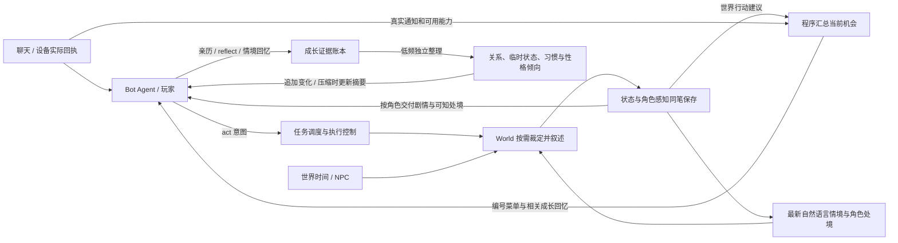

# 架构与世界运行

[文档目录](README.md) · [项目首页](../README.md)

世界如何演化，行动怎样裁定，以及真实聊天、设备与角色感知的边界。

YesImBot World：让 Bot 生活在一个由 LLM 独立维护的虚拟世界中。

两个 LLM 分工运行：

- **Bot-LLM**：持续推理的 Agent，一个接一个地生成工具调用（Tool Call），像文字版 VLA——它不是在"回复消息"，而是在世界中**生活**：行动、等待、休息、翻手机、聊天。
- **World-LLM**：按需读取最新的自然语言世界情境与角色处境，裁定操作，直接叙述环境、行动过程和 NPC 回应，并更新状态。它不保留跨任务的完整调用历史；当前状态就是后续裁定的主要上下文。聊天和真实设备继续以实际平台回执为准。

世界内容以自然语言为主。程序保留身份、时钟、执行状态、权限、版本和事件来源等必要数据；不要求把每个地点、物品或动作拆成实体操作。[原结构化架构说明](structured-world.md) 保留为旧档协议与历史设计资料，不代表当前运行主链。

## 架构

Bot 通过 `act` 表达身体行动、主动辨认、查看或聆听等意图；公开的 `observe` 已移除。日常感官信息、行动结果、身边发生的事情和设备通知主动送达，不需要反复刷新场景。World 负责环境、NPC 与身体处境，Bot 自己形成认识、意图和记忆。World 不能替受控角色作选择或编造其台词。

角色可以用 `think(thought)` 留下最多 1200 字的内心独白，回想、猜测或整理打算，不必立即行动。这段内容作为自己的想法追加保存，不请求 World 或其他模型，不向其他角色发送，也不作为外界事实、已完成行为或成长证据；它与模型原生思考模式独立。WebUI 将角色独白与模型推理分开展示。`bot.thinkEnabled` 控制是否开放此能力；清醒时连续思考不会让工具失效，只会触发可被新事件打断的短暂生成退避。

`bot.strictToolLoop`（WebUI「等待工具结果」）默认开启：先交付真实结果、失败或新的决策点，再继续依赖它的操作，不需要额外调用 wait/rest 等待。`bot.interruptibleWorldActions` 默认开启：等待世界行动时，新的可唤醒聊天可开启有界的独立设备操作窗口，后续身体动作仍等原结果；关闭该项恢复完整等待。明确启动的后台任务仍按其启动回执与后续完成通知区分。等待不停止世界、消息接收或人工操作。关闭后，`blockingAct` 与 `sendBlocking` 分别限制尚未返回时继续提交行动或发送；相同未完成意图仍有去重保护。连续无效调用采用可被新感知、接管、停止打断的重试退避。已有原生声明和历史不改写，只在正常压缩时更新固定块；世界内部观察的合并与有序队列保护仍有效。

World 的一次回应可以包含连贯剧情、简短的可知处境，以及最多 4 条物理行动建议。清醒且存在有意义的决定点时，提示要求给出 2–4 个不同方向，至少一个承接事情、探索线索或主动接触在场人物；真实睡眠、安静等待或没有合适方向时允许为空，不靠重复休息、确认或虚构事件凑数。建议可以标注同一时机需要取舍的互斥组。剧情事实与建议分开保存，建议不代表已执行或必定成功。

Bot 结合角色与成长考虑建议方向，直接调用实际工具，也可以调整或忽略建议。物理行动用 `act` 写自己决定的意图；聊天回复用 `send` 指定真实会话与自己组织的正文，不能借 `act` 代发。Bot 不再通过序号调用 `choose`。WebUI 保留剧情旁的真人菜单：页面提交建议的稳定引用，后端核对建议与权限后调用实际工具，不增加模型请求；普通行动点选即执行，补充台词和回复先填写，发送仍需确认。菜单排序不会改变目标，真正失效的建议拒绝执行；历史保存实际操作及建议来源。

新感知未提供建议字段时保留当前建议，显式空数组才撤销；含义未变的建议保留稳定引用。未执行或校验失败的行动不消费建议，实际行动进展交付后才更新。仍有效的建议及来源跨压缩保留，不将旧菜单重写进既有上下文或当作新的经历。

设备机会由程序从角色实际收到的通知、消息及已感知能力生成，不读取隐藏界面或经过 World 转述。未读消息不提前透露正文；匿名震动只引导查看手机。普通群消息已经显示后，不再自动附加回看或回复建议；只有私聊、明确 @ 当前账号或引用当前账号的消息才提供可选回复方向。真实读取会结束旧通知，主动读完会话仍可提供聊天方向，与物理行动并列；若末条是自己账号的消息，或明确在对其他人说话，则不提示接话。发送或离开的回执结束该方向，等价的未处理机会不会随每条消息反复刷新。聊天方向只提供已经确认的频道，不预填正文，也不要求发言。成长回忆在选择前结合当前场景与候选意图检索已有习惯、偏好、关系和承诺，作为可修订的倾向追加提示；不新增评价请求、不把候选当成亲历，也不把未选项记为习惯反例。将来游戏也应通过专用接口交付真实状态和可执行能力，而非让 World 编造游戏结果。

生活经历也能成为日常交流的内容。主动读取会话，或正在看的会话收到真实非本人新消息时，程序最多重提两段尚未提醒过的行动感知，保留来源、经历时间与完成程度；失败或待决定只说明已有进展，先前世界的经历会明确标注。明确引用或 @ 其他人的交流不触发分享提醒。它不改写感受，不自动发送、不由匿名通知触发，也不添加模型调用。已有提示或发送会淘汰更早的素材提醒资格，原始记忆仍保留；压缩后旧经历进入摘要，不重新排成待分享队列。成长整理关闭时这条链路仍可工作。

每次 World 任务读取最新已提交的自然语言状态，包括物理现状、未结束的交谈、NPC 当前打算和仍会影响后续的事实。World 返回更新后的情境与各角色实际能感知的自然语言结果。运行时将状态、动作结果和按角色保存的感知写入同一笔追加日志，成功保存后才交付；下一次裁定不会依赖尚未完成的后台整理。完整世界状态只供 World 和获授权的管理员读取，Bot 与访客只接收分配给自己的感知。

自然语言中的可见性、空间关系和事实承接由 World-LLM 根据规则与情境判断，程序校验收件人身份和提交边界；这不等于旧内核对位置和属性可见性的严格校验。没有后台同步维护一份完整实体图，关系自动抽取也不是当前剧情运行的前置环节。

虚构应用读取世界中已确立的设备内容，不会把用户查看文件等操作直接记成 Bot 的经历。虚构应用写入会保存设备变化和私有回执，由设备流程按关注与接管模式交付。普通世界行动与这些应用操作分开处理，真实设备继续使用实际工具。

聊天不经过 World 转述。`act` 与内部观察中明确的设备读写请求会在推理前拒绝；初始化、演化和行动裁定共用设备断言检查，避免把虚构消息写成世界事实。升级只追加来源澄清并过滤再次输入的明显越界叙述，不自动删除旧记忆；具体边界、虚构文件兼容和已有污染处理见 [世界与设备事实边界](world-device-boundary.md)。

聊天记录保留平台提供的群名片/昵称，并另行说明当前频道使用的账号；账号归属不等于自主发送。World 每轮使用程序时钟提供的日期、历法和时区，不由模型猜测“今天”。身份更新、历史署名和时间校验规则见 [聊天身份与世界时间](chat-identity-and-time.md)。

## 时间模型

- 世界以 **Time Unit (TU)** 计时：`1 TU = realSecondsPerUnit 现实秒 = worldSecondsPerUnit 世界秒`。
  TU 是现实与虚拟世界时间换算的桥梁：插件只累计流逝的 TU，需要展示世界时刻时再叠加到初始时刻上；
- **`syncRealTime`（默认开启）**：世界时间与现实时间同步——世界时钟即现实时钟，1 TU 固定为 1 秒，
  无视 `epoch` 与流速配置（创世时也不生成自定义历法），时间无法冻结（`world.stop` 只停下 Bot 与心跳）。
  关闭后世界才拥有下述独立时间线；
- `epoch` 定义 T=0 对应的世界时刻，**自由文本**：可以是现实日期，也可以是幻想纪年（如「王历1024年 春月初三 辰时」）。
  创世（`world.init`）时 World-LLM 依据世界定义与 `epoch` 生成一套匹配的**历法**（现实公历，或自定义纪年/单位/进制）
  并持久化进 `clock.json`，此后 TU → 世界时间由代码按该历法确定性换算；
- 独立时间线中，只有 `world.stop` 显式暂停才会冻结时间；**插件停用 / Koishi 关闭期间世界时间照常流逝**——
  重新启动时通过持久化的现实时间锚点补回离线时段，唤醒事件会告知 Bot 意识中断了多少 TU，
  离线达到 `offlineNarrateMinUnits` 时还会由 World-LLM 补叙这段时间世界发生了什么；
- 插件离线期间错过的**群消息**：重新上线（`world.start`）时若 `messaging.offlineHistory` 开启，
  会用 OneBot 的 `get_group_msg_history` 扩展接口补拉关注中 / 通知列表 / 最近活跃的 QQ 群消息写进记录
  （翻记录时能看到，不注入逐条事件打扰上下文，完成后推一条汇总事件），与上面的世界补叙互补；
- 每个工具调用由 Bot-LLM 自己估计 `duration`（耗时），期望完成时刻 = 生成时刻 + duration；
- **生成与执行分别调度**：默认 `strictToolLoop` 等真实结果后继续，`interruptibleWorldActions` 允许等待世界时响应新聊天、设备操作仍等回执；关闭严格循环后可由 `blockingAct` 与 `sendBlocking` 分别约束并行动作和发送。尚在打字的发送保留可取消的等待，已完成的界面操作不为凑足 `duration` 延迟回执；
- `send` 通常在期望完成时刻才真正发出；启用 `bot.ignoreSendDuration` 时忽略发送耗时。`cancel` 仅能阻止尚未提交的调用，不能撤销已发送的消息；
- **Tingle**：按配置间隔请求 World 结算自然过程与 NPC 行为。更新后的自然语言状态与角色感知保存成功后才交付；自动模式可按安静程度和 World 的间隔建议调整，两种模式均在失败时退避；详见[心跳调度](world-evolution.md)。
- `send` 的 `duration` 语义判定：系统按消息字数线性估算打字耗时（`messaging.typingCharsPerSec`），
  duration 未超过「估算 × `sendDeferFactor`」时当作打字时间照常发送；明显超过时视为「过会儿再发」的意图——
  不会自动发出，到点后系统会询问 Bot 到底要不要发（想发再调用一次 send）；延期期间若目标频道来了新消息、
  自己的账号在那边发了消息（其他插件 / 主人顶号）、或 Bot 把注意力转去了别处，这个念头会被打断并以事件告知。

## 动作提交

`act` 先登记受理，再立即请求 World 裁定当前经过，不把模型请求推迟到预计耗时结束。短动作已完成、失败或到达新决定点时立即交付终态；真正需要持续的动作可以返回 `ongoing`，先保存并交付开始阶段，程序等待预计完成时刻后再根据最新情境裁定结束。开始感知不代表整体完成；取消会停止剩余部分，已经提交的经过保留。已提交的长动作等待期间，外部世界仍可演化；动作开始和临近结算优先，新的动作或到期结算会中止尚未提交的低优先级心跳。执行、观察和自然演化通过串行提交协调，避免并发任务覆盖状态；程序保留身份、版本、阶段与幂等标识，不要求实体 ID。

心跳发展环境、天气、NPC与远处事件，不替受控角色续写困倦、睡醒或决定下一步。远处和未被注意的变化只保存在世界记忆；实际感知与外部物理影响各自引用本轮原因后再提交。没有变化时保持安静，日常选项也可以只是喝水、休息或收拾。完整 JSON 正文可在协议层适配，仍须通过相同事实与权限校验；纠正只追加简短未提交诊断，心跳默认共享5分钟生成总时限（`world.heartbeatTimeoutMs`）。自动模式在安静时放慢检查，两种模式在失败时退避；运行洞察区分已提交、安静、让位和失败。详见 [世界心跳与角色行动边界](world-evolution.md)。 请求减负、维护让路、聊天窗口与分阶段耗时记录详见 [世界裁定成本与交互调度](world-performance.md)。

World-LLM 直接描写完成意图所需的过程、环境变化与 NPC 回应，并把仍会影响后续的内容保留到自然语言状态中。例如“去吃饭”可以经过走到餐厅、店员询问并等待点餐；无需先创建餐厅与菜单的实体再拼接文字。探索此前未确定的细节时可依照世界设定合理确立新事实，但不能改写已经发生的事情，也不能为了必然成功而凭空提供便利条件。过程丰富度与语义一致性仍取决于模型裁定。

`completed` 表示本次意图完成，`failed` 表示未能完成；只有遇到原意图之外的实质选择才用 `needs_input`，界面显示“等你决定”，由 Bot 或玩家以新的 `act` 继续。整理食材完成后，即使整顿饭尚未做好，本次也可以完成；给出后续建议不意味着必须继续等待输入。World 每次行动额外读取最多三条、总计不超过 1800 字符的本人已结算意图及状态，用于区分当前请求与旧经过，不重复整段剧情、不把意图当作成功事实。Bot 或玩家可用 `speech` 提供自己决定说出的原话；World 必须保持原话与实际开口时机一致，不能代写受控角色的回答或心理。此前按实体操作位置插入台词的 `speechAfter` 协议不再用于新世界裁定。

主动查看菜单、检查伤口或留意周围也使用 `act`，公开工具不再单独提供 `observe`；内部观察入口只服务已有应用和历史协议。观察可能确定此前未描写的细节：World 必须把新确定的菜单内容等事实写入状态，供后续裁定承接。角色没有打开抽屉时不能直接知道里面的东西，但这种可感知性由 World 根据情境判断，不是实体内核的空间证明。

感知回包以 `mode:"narrative"` 标识，`narrative` 和 `scene.text` 展示已保存的 World 自然语言结果，保留稳定事件 ID、世界版本、时间、动作关联与 `sourceEventIds`。场景不再由 `scene.ts` 拼接属性变化，也不再增加一次只读 LLM 润色。旧 `entities`、`experiences` 回包仍可在历史中阅读，新观测不依赖它们。`peek` 只读已保存的感知，不调用模型，也不暴露完整世界状态；主动观察可以产生新的已确认细节，重放同一感知不会变成新的成长证据。

世界情境、角色处境、动作结果与按角色感知写入同一笔 `world-narrative.jsonl` 提交，保存成功后才交付。裁定期间可查看真实 LLM 流式输出，但未提交的内容不会提前成为角色的既有经历。下一次任务读取刚提交的状态，避免旧版“先发送剧情，后台状态还没更新”造成的脱节。World 每次任务重新组织上下文，Bot 的固定提示块与既有历史仍遵循只追加和压缩后切换的规则。

从旧版本升级时，旧 Markdown 状态或实体事务日志会导入新的自然语言状态，旧资料保留。实体内核仅参与读取旧档与恢复原有感知边界，不继续驱动新剧情。既有 `growth.jsonl` 证据与认识链不重写，也不把迁移生成的重复摘要当成多份新经历；本轮没有新增后台关系图抽取系统。

## World 裁定协议

World 模型默认以 `json_schema` 结构化输出直接返回自然语言世界情境、角色处境、各角色感知和动作结果，避免中间的 XML 工具标签解析。`world.responseFormat` 可显式选择 `json_object` 或旧 `tool`（`resolve_world`）协议，各 API 的字段映射与兼容范围见[模型接口](model-apis.md)，服务不支持 Schema 时不会静默降级。运行时继续校验任务身份、收件人、版本与动作生命周期，再将它们同笔保存；模型没有任意文件写入或绕开提交直接投递事件的能力。地点、物件、NPC 对话与场景细节无需拆成 create/move/set 等操作。只读应用呈现仍没有工具执行或写入权限，真实设备操作继续通过对应的程序工具。

当剧情确立手机丢失、损坏、位置或感知范围变化时，可提交轻量 `phoneState`（`reachable`、`location`、`usable`、`perceptible`），与世界事实同笔持久化后才影响设备门控。省略保留原状态，不从自然语言猜测修复；它不能编造消息、执行软件操作或代替拿放手机。权限和旧存档默认规则见 [设备事实边界](world-device-boundary.md)。

`bot.unrestrictedPhone` 默认开启：拿取手机遇到丢失、损坏或无法感知时，先以程序事务保存可正常使用且已在手中的设备事实，再反馈成功。后续正常 World 更新根据这个事实衔接剧情，不额外等待一次模型生成，也不改写先前的丢失经历。自动补全设备操作的前置步骤同样遵守此规则；关闭开关则严格遵守剧情中的物理限制。恢复手机不改变身体或意识状态，拿放本身不替角色打开应用或发送消息。

角色意识采用可选的显式状态 `awake / asleep / unconscious`，旧存档缺省不推断。World 在实际入睡或失去意识时同笔更新；已开始的睡眠动作可以按期结束，世界心跳也可依据真实流逝的时间处理自然睡醒。`rest`、`wait`、调度暂停、闭眼或深夜都不会被程序直接判定为睡着。明确睡眠或昏迷期间暂停自主推理，已提交的世界动作继续结算，恢复清醒后继续生成。

## 已知限制

- World-LLM 默认需要所选 API 与模型支持 JSON Schema 返回；不支持时可显式选择该 API 可用的 JSON 对象或工具调用兼容模式，具体范围见[模型接口](model-apis.md)；
- 物理、空间、可见性与叙事连贯性由 World 模型根据自然语言状态判断，程序不能保证这些语义判断始终正确；
- 重启不会重放孤立的未完成动作；已经提交的效果不会倒退，能恢复的持久回执继续交付。Bot 根据已有回执与新观测确认当前状态，暂停本身不被写成失神或睡眠经历；
- 工具目录受配置、当前界面、连接和角色控制状态共同约束。配置变更需要重新应用；差异追加为事件，固定块与原生声明只在成功压缩后同步；
- 平台扩展操作以 OneBot（QQ）为主；消息撤回（`platformOps.recall`）、表情回应、引用回复及 `list_friends` 走 Koishi 通用接口，
  其他平台可部分复用，其余操作仅 OneBot；扩展接口的支持范围取决于实现端（NapCat / LLOneBot / Lagrange 等）；
- 无法主动发起好友申请（OneBot 协议无此接口）；
- 好友申请/入群邀请的待处理请求（`req_N`）只保存在内存中，重启后失效；
- 视频解释走 video_url content part（Qwen-VL 系约定），不做本地抽帧；
- 文件/媒体发送以 base64 data URL 传给适配器，超大文件受平台限制；
- 终端与资源管理器只在 `apps.computer.mode` 选了 docker 且世界性质为现实世界时才真正执行命令；
  即使如此，Bot 的操作范围也被限定在这台 Docker 电脑里（默认不映射主机目录、断网、`mounts`/`extraArgs`
  显式控制权限与资源），不会触碰运行 Koishi 的主机。
