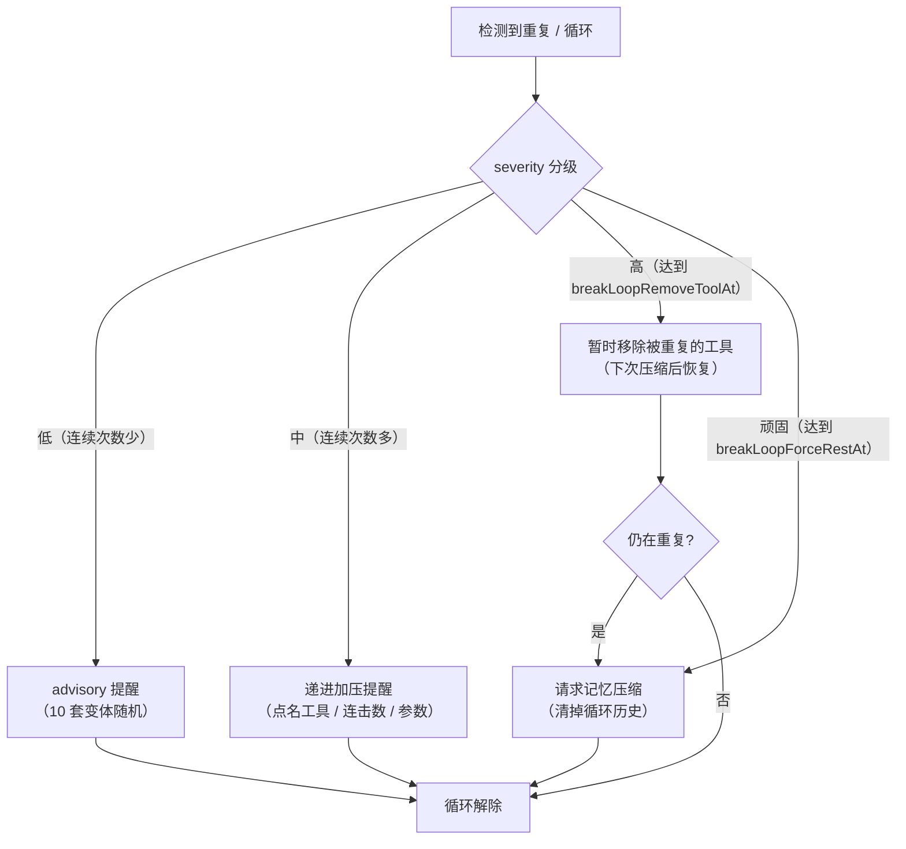

# 角色记忆、成长与存档

[文档目录](README.md) · [项目首页](../README.md)

数据目录、追加式上下文、成长证据、压缩恢复与循环治理。

## 数据目录（`basePath`，默认 `data/yesimbot-world`）

| 文件 | 维护者 | 说明 |
|---|---|---|
| `Bot_Definition.md` | **用户** | Bot 角色定义（创世输入；原文以「最初的设定」置顶注入，见下文上下文规则） |
| `World_Definition.md` | **用户** | 世界定义（创世输入，World-LLM 的最高准则） |
| `world-narrative.jsonl` | 自然语言世界运行时 | 当前世界情境、角色处境、动作生命周期与按角色感知的权威追加日志；同笔保存，保留版本、事件 ID 和来源用于恢复与去重 |
| `Bot_Status.md` / `World_Status.md` | 状态阅读镜像 | 旧自然语言存档的迁移来源，迁移前快照保留原文；之后从已提交日志生成当前状态镜像，不作为独立写入接口 |
| `world-transactions.jsonl` | 旧版迁移资料 | 读取旧实体状态、对话和经历用于导入；原日志保留，新世界任务不再向实体内核提交操作 |
| `growth.jsonl` | 角色成长账本 | 亲历证据、六类认识与修订链、自动整理游标及待交付结果；只追加，可恢复 |
| `context-commit.json` | 上下文提交恢复 | 压缩切换过程中出现，完成后清除 |
| `News.jsonl` | 历史资料 | 保留原新闻；真实 RSS 在新闻应用中带来源和发布时间显示 |
| `facts.jsonl` | 历史资料 / 用户 | 保留旧小事记与固定条目；不自动升级为角色成长证据 |
| `gallery/` | **用户 + Bot** | 收藏夹，按分类子目录存放：`表情包/`、`meme/`、`截图/`、`照片/`、`未整理/`。用户手动投放的文件放进 `未整理/`（或直接丢根目录，会被自动清扫进去）；角色按需要选用、记录自己的用途备注或归类，不自动生成整理任务 |
| `assets/` | 运行时 | 媒体资产库（收到/发出的图片、音频、视频，sha256 去重） |
| `stream.jsonl` | 运行时 | Bot 工作窗口（Tool Call 流）持久化 |
| `pinned.json` | 运行时 | 置顶上下文 + id 计数器 |
| `clock.json` | 运行时 | World Clock（世界时间 + 创世时生成的历法） |
| `meta.json` | 运行时 | 世界元数据（创世时判定：是否现实世界设定） |
| `phoneShell.html` | World-LLM / 用户 | 手机状态栏与浏览器工具栏的截图外壳 HTML（含 `{{screen}}` 等占位符），跨重置/重新创世复用；可在 WebUI「世界设定 → 手机与浏览器外壳」预览、编辑或独立重新生成 |
| `focus.json` | 运行时 | Bot 正在关注的频道；手机可用且在手时呈现会话正文，通知模式另管振动与唤醒 |
| `notify.json` | 运行时 | 频道通知策略、振动/静音/关闭模式、未读与通知卡片；随存档恢复和重置 |
| `phone-tool-catalog.json` / `computer-tool-catalog.json` | 角色的设备知识 | 已经学会的应用工具及所属应用；随世界存档、回档和重置，偷偷打开未被看见的应用不新增知识 |
| `spill/` | 运行时 | 工具结果溢出治理（`bot.spillMinChars`）裁剪后的全文落盘：`<callId>.txt`；上下文里只留 head/tail 预览，完整结果可在此审计 |
| `archive/` | 运行时 | 压缩/重置/手动存档的历史快照（每份一个时间戳文件夹，含 `manifest.json`；可在 WebUI「记事与存档」页查看、回档、删除） |

## Bot 上下文规则

- 角色定义来自用户的 `Bot_Definition.md`；身体和环境来自角色可见的观测；成长单独保存在证据账本中。
- 事件在模型生成之间追加。工具接受、执行、提交与结果交付分别处理，失败不会伪装成成功。
- 固定提示块、原生工具声明和已经渲染的历史媒体在一个工作窗口内保持不变。能力变化与错误解释追加为事件，成功压缩后才切换固定块和媒体预算窗口。
- 固定提示块与原生工具声明在请求提交前持久化；重启沿用该窗口的原文、起始时刻与声明，不因代码更新提前改写前缀。首次升级的旧存档没有保存过这些渲染结果时，从首次新请求开始保存。
- 每条意识流记录保留独立的请求消息边界；新增同角色事件也不会合并进上一条已发送消息，完整的历史消息前缀保持稳定。
- 上下文达到阈值时只请求压缩，不制造疲劳、强迫角色入睡或改写状态。
- 压缩与生成互斥；按快照清理已经成功总结的前缀，保留期间新到的事件。失败保留原流；跨文件切换可从提交记录恢复。
- 压缩输入排除程序的行动菜单、能力变更和已标记的失败后用法教程，真实错误与执行结果仍保留。程序另外保留最多 12 条、每会话最多 6 条且总计不超过 4000 字符的已交付聊天归属参考，同笔提交到置顶记忆；区分发言人、引用作者、自己账号发言与确认亲自发送。它只在正常压缩后进入新固定块，不修改旧请求，也不把发言当作正确答案或问题已解决的证明。
- `rest` 是角色主动选择的可唤醒等待。停止服务可以立刻中断，不等待睡眠时长。
- `reflect` 引用已经实际感知的事件，支持关系、承诺、偏好、临时状态、情境习惯和性格倾向；反证、修订和停止沿用均保留历史。主观认识用自然语言表达，不用性格分数决定行为。
- `recall_growth(scope="evidence", keyword?, event_ids?, n?)` 可以检索或精确重读亲历事件，包括已从当前上下文压缩掉的证据；默认 `scope="claims"` 查询认识，`scope="all"` 同时返回两者。回忆不会制造新的经历。
- 自动整理默认开启：累计 4 段新的亲历后，发起独立、有限输入的整理请求（标记为 Growth，单独记录用量），默认沿用 Bot 模型，也可通过 `bot.growth.llm` 独立配置。整理不阻塞主行动循环；请求按实际使用的端点遵守串行设置，不同源的端点互不等待。默认两次尝试至少间隔 120 秒，等待与生成总超时 90 秒；压缩边界可整理较少的新经历，但不绕过间隔。允许没有变化，不要求凑齐类别。旧配置显式保存的超时值保持不变，可在 WebUI 调整。
- 自动整理仅形成长期认识，不再新建临时状态或动作流水账；原始经历与手动记录的短期处境仍保留，短期状态不进入自动情境回忆和固定成长摘要。关系、承诺、偏好的新增/修订须给出 `insight.dimension`（稳定认识维度）、`significance`（后续意义）及 `anchors`（逐字原文与事件 ID）。网页选项不等于已选择，讨论不等于承诺，同对象同维度优先修订。程序核验来源与可见原文，认识是否有意义仍需整理模型判断。
- 自动整理逐项校验和采纳提案：一条无效习惯或性格提案不会阻止同批有效关系、偏好等认识保存。未采纳原因与完整审阅结果一同记录，下一次整理会收到校验反馈；整次请求超时或格式错误则保留原经历等待重试，不推进已完成审阅游标。
- 积压达到 128 条旧经历时，将较早材料转入独立的历史补审队列，优先处理最近半世界小时的经历；历史原文和未完成的补审进度持续保留，相关旧证据也可以被检索回后续整理。代表性采样明确区分实际展示与省略的材料，未展示内容不能用作本次结论的证据。管理员在成长页无记录时仍可查看待审阅、历史补审、逐项拒绝原因及最近生成失败；已完成但没有新结论不会显示成生成失败。
- 整理只读已交付的亲历与既有认识。聊天通知和回读按平台消息来源去重；自己的发送回执与频道回读分开保存。相同经历中的重复操作不能刷次数。仅操纵身体的结果是被迫经历；完全入替时实际完成的选择属于角色；偷偷操作不交付的回执不能成为亲历。失败、送达未知、计划和观察别人不算自己的已完成选择。
- 整理在 24 条证据预算内，为当前经历保留代表，同时按实际共同动作、人物和频道检索跨日的相关自主选择；不会随机拼凑无关旧动作。习惯至少有 3 段独立的自主完成选择且跨一个世界日，性格倾向至少 6 段、跨七个世界日且覆盖 3 种情境；这些只是验证底线，整理模型仍须判断内容是否真实支持该结论。当前明确核验的选择主要来自世界行动与已确认发送；缺少可信结果的旧记录或工具不会被猜成成功。创建或更新当前临时状态必须有最近两世界小时内的支持证据，默认从实际经历时刻起持续两世界小时、最长一天，不从迟到的整理时刻重新续期；到期后退出当前沿用的认识。旧版自动整理曾用过时证据生成的当前状态，通过独立时间校正保留原始记录、修正有效期，并只追加更正说明；不因单纯没有新记录就判定习惯消退。
- 缺少语义依据的旧认识保留原记录并隔离，不自动回忆或进入摘要。原证据复核使用既有后台整理节奏，每四次完成的整理预留一次（新材料审完时也可处理），每批最多两项；只修订或停止沿用原认识，不生成新经历、不推进新经历游标。材料不足就继续待核实，同版本不无限重复复审。
- 新认识与相关回忆只追加到工作窗口，不改已经发出的历史。回忆依据当前实际感知的情境与身份检索，同一版本在当前窗口内不会反复提醒；正常压缩时才更新固定块中的成长摘要。整理结果与证据游标同笔保存，交付失败或重启可续投，不把回顾本身当作新经历。
- WebUI 的 Bot 配置中可调整 `bot.growth` 的启用开关、独立经历数量、间隔、超时、请求字符预算与情境回忆数量。关闭自动整理后，已有认识保留，仍可主动 `reflect` / `recall_growth`；累计 24 个独立来源时只追加一次可选择忽略的整理提示。

成长整理可在 WebUI 的 Bot 配置下设置 `growth.llm`，选择 `mode: inherit`（默认沿用 Bot）或 `mode: independent`（独立 API 地址、密钥、模型、温度、输出 token 上限、思考与流式开关）。继承模式的温度至多 0.4，输出上限限制在 2048–8192 token；独立模式直接使用填写的参数，必须填写 `baseURL` 与 `model`，空 `apiKey` 表示该服务不使用密钥。`reviewTimeoutMs` 控制整理的等待和生成总时限。主角色与世界裁定的模型配置不受影响。

旧版内在调节、递质模拟和收益学习已移除，行动不再等待该评价模型。`think` 内心独白、亲历证据和成长整理继续保留。加载带有旧调节提示的世界时，只追加一次停用说明，已发送的上下文前缀不重写；正常压缩后不再生成调节摘要。旧 `regulation.jsonl` 仅作为历史审计随归档、恢复与重置保留，不再参与决策或恢复运行状态。

## 上下文退化治理（防复读 / 防循环）

长时间自主运行的 LLM 会退化成几种循环：**复读同一个工具调用**、**交替循环**
（`act ↔ wait` 反复）、**口头禅式重复发言**。插件用「纵深防御」层层拦截（从最温和的提醒到最硬的阻断），
并把所有提醒文案都做成 **≥10 套字面差异大的变体随机返回**（事实值如次数/工具名/参数原样保留，只随机话术），
避免固定文案本身在长上下文里被模型无视、成为另一种循环。

| 层 | 机制 | 说明 |
|---|---|---|
| 单工具复读 | **RepeatGuard**（移植 dsh 的 repeat-tool-reminder） | 按 `(工具名, 规范化参数)` 链式计数，连续相同达阈值（默认 `[3,5,8]`）时简短提醒检查上次结果；计数和参数保留内部诊断。仅提醒，不硬拦 |
| 交替循环 | **跨工具周期检测** | 滚动窗口识别 `act → wait → act → wait` 这类短周期反复（≥3 轮），点明「你在反复执行同一组动作」 |
| 口头禅复读 | **近 N 条发言去重**（`messaging.recentRepeatThreshold` / `recentRepeatWindow`） | 同一句话在最近 N 条里重复达到阈值就拦；**判重只按「频道 + 内容 + 图片」，忽略引用/@ 目标**——同一句话引用 A 还是 B 都是同一句 |
| 同上重复 | **same-act / same-send 拦截** | 默认等待真实结果再生成；非严格模式下，`blockingAct` / `sendBlocking` 可分别拦截尚未完成的连续行动 / 发送 |
| 压缩折叠 | **serializeForCompression** | 压缩时把「连续完全相同的工具调用」折叠成一条 + 汇总标记，避免复读正文被 World-LLM 当真实经历沉淀进摘要 |
| 结果裁剪 | **spill / prune**（`bot.spillMinChars`） | 超阈值（默认 4000 字符）的纯文本工具结果裁成「头部 + 省略 + 尾部」，全文落盘 `spill/`，防止超大结果反复占据窗口 |
| 强力兜底 | **breakLoop**（默认关） | 两段升级：先「暂时移除被重复的工具」（`breakLoopRemoveToolAt`，默认 6 次），无效再「请求记忆压缩」（`breakLoopForceRestAt`，默认 12 次）。移除的工具在下次压缩后自动恢复 |

相关配置（`bot.*`，除标注外）：

| 配置 | 默认 | 说明 |
|---|---|---|
| `repeatThresholds` | `[3, 5, 8]` | 单工具连续重复提醒阈值（升序；`[]` 关闭） |
| `repeatExclude` | `[]` | 排除的工具名匹配（`*` 通配）；bookkeeping 工具既不计数也不重置，不会洗白循环。代码里对 `rest`/`wait` 有默认兜底 |
| `spillMinChars` | `4000` | 工具结果溢出裁剪阈值（`0` 禁用） |
| `breakLoop` | `false` | 打破死循环的强制手段总开关 |
| `breakLoopRemoveToolAt` | `6` | 连续重复达此次数暂时移除该工具 |
| `breakLoopForceRestAt` | `12` | 移除后仍重复达此次数请求记忆压缩 |
| `messaging.recentRepeatThreshold` | `1` | 近 N 条里同一句出现这么多次就拦（第 2 次拦） |
| `messaging.recentRepeatWindow` | `20` | 近期重复检测的滑动窗口条数 |
