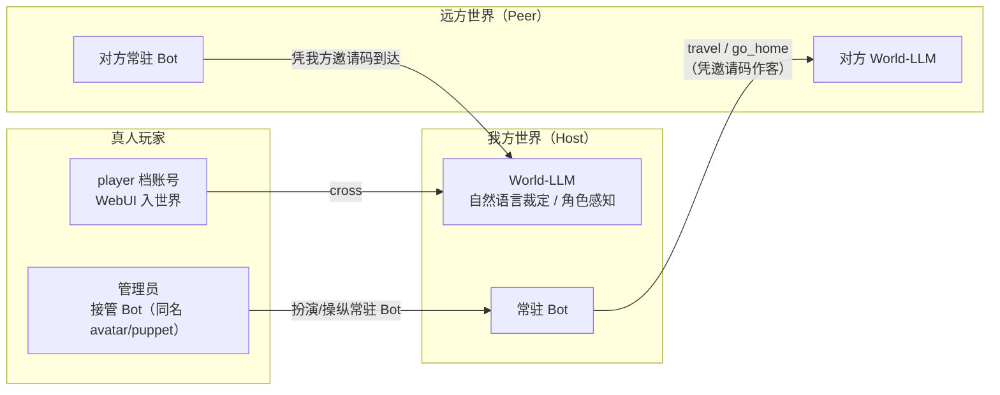

# 玩家、访客与联机世界

[文档目录](README.md) · [项目首页](../README.md)

以独立角色走进世界、接管常驻角色，或让不同世界之间互访。

## WebUI 访客模式（只读 · 多账号 · 分级授权）

运维 WebUI 除了管理员（凭 `webui.token`）之外，还支持**访客账号**登录——给协作者/玩家一个**只读**视角（玩家档除外，见下文的「入世界」）。账号由管理员在 WebUI 里增删改，存 `<webuiDir>/visitors.json`。

- **多账号 + 密码哈希**：每个账号独立用户名/密码（scrypt 加盐哈希，不存明文）；密码登录后派发**短期会话 token**（内存态，12 小时 TTL，重启失效）；
- **权限实时生效**：会话只记账号 id，每次请求**实时从账号表刷新** grants/preset——管理员改权限或删账号，访客立即生效（删号即时失效）；
- **档位（preset）**决定默认可见的数据块集合（也可逐项调整成 `custom`）：
  - **operator（运维）**：全读（含 debug 原始请求/响应、config、prompts、usage），唯独默认**不看 bot_status**（运维员不看 Bot 人设/现状）；
  - **viewer（观察者）**：读世界演化产物（world_status/bot_status/news/facts/stream/notes/gallery/media/archive/devices/crossing/overview），**不看** definitions/config/prompts/debug/usage；
  - **player（玩家）**：只以「角色视角」入世界——看世界剧情（overview/world_status/news），不看 Bot 内心/状态/意识流/定义等内部；
  - **custom（自定义）**：按 16 个 grants 块开关逐项控制（overview / world_status / bot_status / news / facts / stream / notes / gallery / archive / devices / crossing / definitions / config / prompts / debug / usage）；
- **只读保证**：访客的写请求一律拒绝（服务端强制，不是靠前端藏按钮），唯独两类例外：
  - 访客可改**自己的密码**；
  - `player` 档账号可用 `/api/player/*` 执行自己的**入世界写操作**（arrive / task / leave）。

## 穿越与真人入世界

除了常驻 Bot 自己生活，世界还支持**双向互动**——Bot 穿越去别的世界作客，以及**真人**（或异世界 Bot）进来。

### 联机穿越（`crossing.*`，Bot 到异世界作客 / 接待异世界 Bot）

- **去作客**：`crossing.worlds` 填别人分享给你的邀请码 + 地址，并允许自主前往后，Bot 可在当前能力允许时调用 `travel`（或由 `world.travel` 强制送去）；作客期间动作由宿主世界裁定，感知由宿主 World 根据角色处境裁定，程序按访客身份交付，自己的世界照常存在，`go_home` 返回；
- **接待访客**：`crossing.serverEnabled` 开启后本世界起一个 HTTP + SSE 服务（`crossing.port`，默认 18112），持有你 `crossing.invites` 邀请码的异世界 Bot 可以凭码到达（`maxVisitors` 限制同时接待数，SSE 断线 180s 自动视为离开）；
- **安全边界**：网络上只传任务与事件**文本**，**绝不传任何 LLM API 地址/密钥，也不暴露世界文件**——程序只向访客交付宿主为该角色保存的感知，不直接传递全知状态；感知正文的语义边界仍取决于宿主 World 的裁定；
- **访客档案**作为角色创作资料传递，不把其中的物品、位置或能力直接当作宿主世界的事实。旧 `visitorPersonaMode` 已停用，不再提供没有实际作用的档案工具选项。

### 真人入世界（`player` 档账号）

真人通过 WebUI 的 `player` 账号登录，以 `cross` 方式创建独立访客角色。任务按会话 ID 绑定，不能通过同名冒用他人；到达完成后才接受动作，按世界秒换算时长，离开会取消未提交任务并清理角色。

玩家页面以当前剧情、可知处境和下一步选择为中心。建议可直接点选，也可先补充逐字台词；底部浮动输入框保留自由行动与高级参数。点选不覆盖正在编写的草稿，改写建议前可先暂存，更新和重连不重新聚焦输入法。选择提交稳定的建议标识和来源，由后端决定真实动作、校验是否仍有效；失效会明确拒绝。访客菜单随 SSE 同步，单调版本防止旧回放复活已消费的选项；无需输入实体或工具编号，也不额外请求模型来解释选项。

普通 NPC 的 avatar/puppet 接管暂不开放，需要进一步实现明确的角色选择和控制权移交。管理员接管常驻 Bot 保留为下面的独立功能，不创建同名副本。

### 管理员接管 Bot（手动驾驶）

管理员在「走进世界」选择**接管常驻角色**，页面自动使用 Bot 的名字和角色定义，再选择 `avatar`/`puppet`：

- **完全入替（avatar）**：暂停自主生成，由用户代替角色决定意图。调用和实际结果进入角色的意识流，离场后自然继承为自己的选择与经历；操作来源另存审计记录，不编造“醒来”或附身经历。
- **仅操纵身体（puppet）**：Bot 继续观察、回忆、反思和等待，身体与设备由用户控制。动作回执明确是非自主经历，并可唤醒仍存在的意识；角色的感受与解释由它自己形成。用户不能通过此模式替 Bot 反思或修改认识。
- 驾驶舱使用后端当前开放的工具 Schema，应用、频道、目标、消息及媒体优先按名称或摘要点选，数组和嵌套对象按字段编辑；高级原始参数保留在折叠选项中。应用/频道切换后同步能力目录。等待和休息按参数中的 TU 计时；其他工具的预计世界秒会换算为 TU，发送工具需明确确认。
- 手机上的浮动操作台适配底部导航和软键盘，可收起以阅读世界。状态更新保留当前输入、焦点和草稿；行动组汇集自然语言经过与结果；直接描述行动或观察意图，目标可填写名字或描述。旧观测中的实体按钮以名称带入目标，不再发送 `observationId`。驾驶舱镜像当前授权会话中已持久交付给 Bot 的同源感知事件，重连按稳定 ID 去重；会话仅保留最近 256 条镜像供回放，不读取全部世界日志或额外调用观察。
- 切换到设备、洞察等页面仍保留角色连接。角色模式控制设备语义，设备页不能单独解除角色接管。离场需等到已提交操作的真实回执；长期失联会收尾并归还控制。接口见 [设备与玩家文档](webui-devices.md)。
