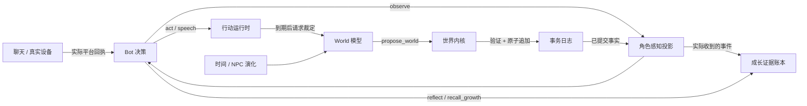

# 结构化世界与角色成长

这次改造把原先的「World 先讲述结果，再后台改 Markdown」改为「提出事务 → 内核校验 → 持久提交 → 角色观测」。结构化链路是默认运行路径，旧的 `update`、`send_event` 世界写入循环已经删除。

它是一套借鉴 VLA 闭环的符号环境，还不是训练后的视觉动作模型。自然语言继续承担角色定义、意图、台词、文件内容和界面呈现；位置、归属、状态及发生过的变更由结构化数据管理。

## 各模块负责什么



- `src/world/state.ts`：实体、属性可见性、行动、事务和观测类型。
- `src/world/kernel.ts`：单写入队列、校验、乐观并发控制、持久事务、恢复、可见性与角色观察句柄。
- `src/world/bus.ts`：带类型、优先级、因果标识的消息信封。优先级是调度元数据，已提交状态始终按日志顺序解释，不因优先级重排历史。
- `src/world/runtime.ts`：初始化/迁移、定时行动、模型提案与失败处理。模型不直接写文件。
- `src/world/agent.ts`：对现有服务的适配，保留元数据生成、只读呈现及摘要功能。
- `src/bot/growth.ts`：角色实际感知的证据登记和可修订的关系、承诺、偏好记录。

总线借鉴 CAN 的地址、消息分类和优先级思路；它不是 CAN 协议实现，也不使用物理总线仲裁。内核重放不会重新发消息、执行工具或再次调用模型。

## 状态、行动与观测

实体是 `actor`、`place`、`object`。每个实体只有一个当前位置，引用须存在，容纳关系不能成环。属性显式标注 `public`、`owner` 或 `hidden`。观察依据角色位置和容器遮挡投影：远处人物、他人包内物品和秘密属性不会直接进入 Bot 上下文。

Bot 使用观察返回的 `seen:…` 句柄选择目标，不能猜数据库 ID。`act` 可带 `target`、`observationId`；`speech` 是角色自己决定的逐字台词。World 模型不能为受控角色生成台词或修改人格、关系、意图和记忆。

动作接受、动作结算、结果交付是不同阶段。开始时登记 pending；达到完成时刻后才按当前状态裁定；校验目标版本，最终变更与动作完成标记在同一事务提交。失败不会作为成功回执返回。取消只在最终提交边界之前生效；平台发送和真实设备等已提交操作返回 `too_late`，保留实际结果回执。

目前空间规则是离散场所与容器模型；复杂连续物理、寻路、能量守恒等没有完整实现，动作可行性仍有一部分依赖裁定模型。新增玩法应逐步引入确定性规则及场景测试，不把提示词当作物理引擎。

`query` 没有世界写入能力；呈现模型只能获得角色的观测。虚构网页、天气、文件内容缺少已建模信息时返回不可用/未知；虚构文件操作与终端命令经动作事务处理，不再靠一段“操作成功”的文本假装持久化。真实电脑与聊天服务继续以真实执行回执为准。RSS 保留来源与发布时间，未知日期保持未知，不把抓取到的旧新闻当作刚发生的世界事实。

## 成长与记忆

角色定义是用户创作的身份资料；身体状态来自世界观测；成长是角色对自己收到的信息的解释。三者分开保存。

`reflect` 必须引用已交付给当前角色的事件 ID。账本保存原始来源 ID，重复观察、摘要与回忆不会成为新的独立经历。关系、承诺和偏好可以追加支持、反证或修订，旧版本保留；证据条数不会自动变成永久人格分数。当前实现校验证据来源与去重，不判断一段证据是否足以在语义上支持某个认识。

上下文压缩只整理已经发生的经历，不触发身体疲劳、强制睡眠或改写人格。模型生成与压缩在循环边界互斥；压缩快照之后到达的事件保留。分段总结任何一步失败都会保留原始工作窗口。`context-commit.json` 保护 stream/pinned 切换时的崩溃恢复。角色主动 `rest` 采用可唤醒定时器，停止服务不用等待睡眠计时结束。

旧 `facts.jsonl` 作为历史资料保留，不自动导入成长证据；需要经过角色实际感知和反思。旧提示词中的 Bot_Status 改写指令不再拥有状态写入渠道。

已提交的平台操作在 Bot 停止后才返回时，回执写入独立 `bot-receipts/` 收件箱，新实例按固定事件 ID 导入一次。`bot-receipts-epoch` 在重置或还原前轮换且不随存档回退，旧时间线的晚回结果不会进入新角色记忆；旧回执保留用于管理员审计。

## 数据升级与回退

- 权威状态与观察日志：`world-transactions.jsonl`。
- 成长与证据：`growth.jsonl`。
- 角色上下文：`pinned.json`、`stream.jsonl`，以及短暂存在的 `context-commit.json`。
- 旧 `Bot_Status.md`、`World_Status.md`：迁移资料，不能继续作为状态编辑入口。WebUI 提供结构化状态、事件和成长的只读检查。

启动已有 Markdown 世界时，会先保存 `before-structured-migration` 快照，再调用配置中的 World 模型提取结构化初始事实，全部验证通过后才提交。迁移失败保留旧文件并报告错误，不悄悄以空世界替代。迁移会使用模型，因此不要把测试通过等同于某一份历史日记已正确迁移；应检查新实体和位置是否符合原设定。

迁移工具使用明确的 JSON Schema，仅允许 `create`。`location` 必须引用同批或已有实体的 **id**；根地点使用 `null`，无需无限补建校园、城市等外层地点。`owner` 只用于物件并引用角色，角色自身没有 `owner`。内核在整批创建后校验引用，支持前向引用；一次汇总所有悬空引用、类型错误和包含环，反馈源实体、字段和目标，让模型修正完整事务。最多三轮，仍不合法则停止；WebUI 调试流中的“结构化迁移·提案校验失败”保留完整诊断。

存档、还原和重置包含事务、成长及上下文提交记录；还原旧存档时删除新世界残留文件，避免旧人物继承新世界经历。停止服务后再进行版本切换或手工目录恢复。跨多个进程共同写同一数据目录不受支持。显式观测已完整写入日志，启动时恢复上一份观测再获取当前观测；目前没有实现完整的网络投递确认（ACK）协议。

自动回归套件使用临时目录和桩，不访问运行中的世界、不调用真实 LLM、不操作 Docker、不发送平台消息。部署新构建并重新加载插件后才启用新代码。

## 联机与平台边界

访客以会话 ID 绑定角色，初始化完成后才能提交任务。跨世界时长按世界秒交换，再换算为宿主 TU；重复 taskId 不重复执行，离开会中止尚未提交的操作。远方世界的观测不覆写本地角色身份和状态文件。联机没有实现跨主机原子事务；请求已发出后连接丢失的结果可能不确定，不能自动重放物理动作。

当前结构化访客路径采用独立角色进入（cross）。管理员仍可接管常驻 Bot，不生成重复实体。avatar/puppet 需要明确的实体选择和控制权移交协议，不能只靠提示词把同名副本当成原角色。管理员手动驾驶 Bot 是单独的功能。

WebUI 管理员可以查看全局结构化世界；普通查看者按授权读取资料，不可借 pinned.json、归档或邀请码获得更高权限。生成的手机 HTML 在受限 iframe 中预览。Docker 已有容器启动失败不会删容器重建，多账号频道使用 `platform@<encoded selfId>:channelId`；旧 key 仅在账号唯一可判定时兼容。

## 验证

```sh
npm run check
npm test
npm run build
```

`npm test` 自动发现 `scripts/test-*.ts`，将测试编译到临时目录，运行后清理；不运行原有会连接外部服务的 smoke 脚本。回归覆盖世界事务与重放、观察隔离、定时与取消、成长去重及反证、上下文恢复、存档迁移、权限、媒体、Docker 和多账号路由。

本次环境验收：TypeScript 检查、8 套离线回归、隔离目录中的 CJS/ESM/声明文件构建，以及 CJS 插件加载均通过。ESM 的运行加载被当前安装的 Koishi 4.18.11 依赖阻塞：仅执行 `node --input-type=module -e 'import("koishi")'` 就会在 `@koishijs/loader` 报 `Class extends value #<Object> is not a constructor or null`。这属于独立可复现的现有依赖问题，不能将 ESM 运行加载标记为已通过；没有为此修改在线实例的依赖。
